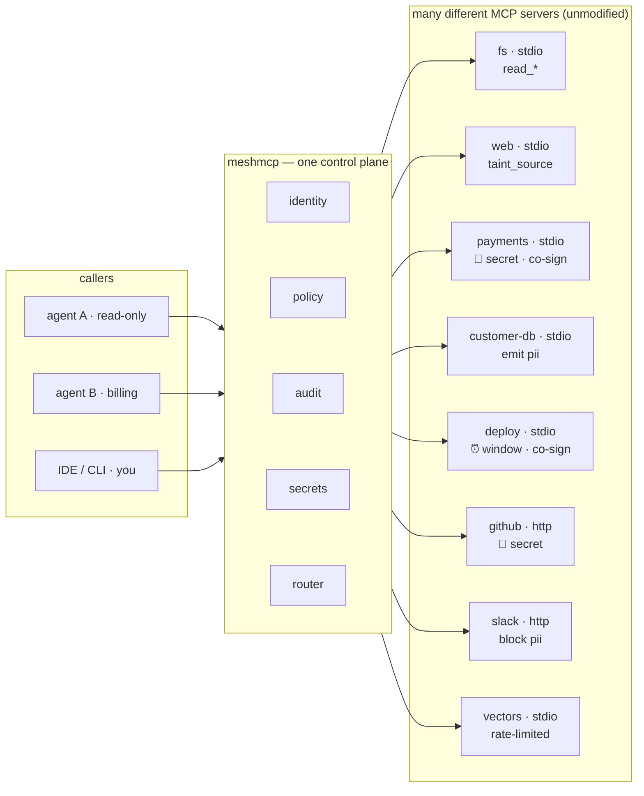

<div align="center">

# 🕸️ meshmcp

### The identity-native control plane for agent-to-tool traffic

Expose any [Model Context Protocol](https://modelcontextprotocol.io) server as a **dark service** —
reachable only over a private WireGuard mesh, with **no public application ingress**, a transport-bound
cryptographic identity for every caller, an **agent firewall** that enforces what each agent may do,
and a **gateway-signed, tamper-evident audit log** of every decision.

> **Positioning:** a self-hosted agent firewall for private MCP servers — no public application
> ingress **by default**, transport-bound workload identity, enforceable tool/method policy, and a
> gateway-signed tamper-evident decision log. See **[docs/THREAT-MODEL.md](docs/THREAT-MODEL.md)** for
> the exact guarantee and limit of each control, and **[docs/CAPABILITY-MATRIX.md](docs/CAPABILITY-MATRIX.md)**
> for what is stable vs. experimental.
>
> One deliberate, opt-in exception exists for **hosted MCP clients that cannot join a mesh** (e.g.
> [claude.ai](https://claude.ai) custom connectors): `meshmcp edge` runs a single, **off-by-default**,
> operator-configured TLS ingress that terminates OAuth 2.1 + PKCE (with operator-in-the-loop consent)
> and exposes **exactly one tool-scoped backend** at `/mcp`. Behind that door the hosted client is just
> another identity (`oauth:<client_id>`) subject to the same default-deny policy, an Ed25519 capability
> double-gate, and the fail-closed audit log. See the recorded exposure-model decision in
> **[docs/spec/OAUTH-STANDARDS.md](docs/spec/OAUTH-STANDARDS.md)** and the walkthrough in
> **[docs/COOKBOOK.md](docs/COOKBOOK.md)**.

> ⚖️ **License & current status.** meshmcp is **not** open source (yet). The current
> [`LICENSE`](LICENSE) is **proprietary and read-only**: you may view the source for evaluation, but
> running, deploying, copying, modifying, or distributing it requires the copyright holder's prior
> written permission. The build-and-run steps below are provided for reference and become usable once
> you have obtained permission or the project adopts an open license. The licensing model is under
> review — see **[LICENSE-DECISION.md](LICENSE-DECISION.md)**. To report a security issue, see
> **[SECURITY.md](SECURITY.md)**.

<br>


<sub>userspace WireGuard, no TUN, no admin rights · stdio + Streamable-HTTP · one static binary</sub>

<br><br>

[](https://xrey167.github.io/meshmcp/)

**Govern a live AI agent's MCP tool-calls** — allow · co-sign · deny — then operate the whole
private agent fabric through **Air**, one calm Home for nearby agents, live work, sharing, and
human attention — and watch your own data become a **tamper-evident, hash-chained proof**. The
interactive preview runs entirely in your
browser (camera / screen / mic work too): **[xrey167.github.io/meshmcp](https://xrey167.github.io/meshmcp/)**

</div>

---

An MCP server is normally a local stdio process or an open HTTP port. Sharing one securely across
machines means a VPN, a reverse proxy, an auth layer, an audit pipeline, and hoping the connection
holds. **meshmcp collapses all of that into one library** wrapped around any MCP server you already
have — connectivity, identity, policy, and proof, as five composable layers:

```
        clients / agents / IDEs  ──  meshmcp call · connect · your MCP client
                    │
        ════════════▼════════════  WireGuard mesh · no public ports · nmap finds nothing
        │                        │
        │  UNDERSTAND   insight   │   policy from behavior: profile · recommend · simulate · detect
        │  PROVE        audit     │   Ed25519-signed, hash-chained log · dashboard · replay
        │  ENFORCE      firewall  │   policy engine: rate · window · taint · data-flow labels · co-sign
        │  CONNECT      mesh       │   cryptographic identity · resumable + migratable sessions
        │                        │
        ════════════▼════════════
        any MCP server (stdio or HTTP), unmodified   ·   fs · fetch · db · your tools
```

Scale it out with an aggregating **router**, a managed **control plane**, and cross-org **federation**.

---

## Why it's different

Many MCP gateways authorize on an application-layer header or bearer token the caller supplies.
meshmcp instead keys policy, audit, and routing off the **WireGuard public key the transport proves**
— identity is derived from the authenticated transport at every enforcement point, not read from a
caller-supplied header, `_meta`, or request body. A caller cannot present an identity it does not hold
the private key for. This is authentication and workload identity; it is **not** by itself
authorization — every privileged surface additionally enforces default-deny policy (see the threat
model for where this boundary holds and where it does not, e.g. a compromised in-mesh peer or a
key-holding insider).

| | |
|---|---|
| 🔒 **Zero exposure** | Backends listen only on the mesh interface. No public port to scan, phish, or DDoS. |
| 🪪 **Cryptographic identity** | Every request resolves to the caller's WireGuard public key + mesh FQDN — the root of policy and audit, not a claim. |
| 🔁 **Sessions that survive** | In-order frame delivery with duplicate suppression on reconnect over a bounded, flow-controlled buffer; survives client roaming. Cross-gateway failover and end-to-end idempotency are experimental — meshmcp does **not** claim exactly-once *tool execution* (see the delivery-vs-execution guarantees in the threat model). |
| 🧱 **The agent firewall** | Allow/deny per tool & method by identity, **rate limits**, **time windows**, **human co-sign**, and **data-flow labels** — enforced where no jailbreak can reach it. |
| 🧾 **Gateway-signed audit** | Every decision is a hash-chained record sealed by **Ed25519-signed Merkle checkpoints**. `audit verify` reports one of four honest states — invalid, valid-but-untrusted-key, valid-but-unsealed-tail, or fully sealed — and only a **sealed** log verified against a **pinned** expected key is complete and trusted. It is tamper-evident against a file editor, not proof every real-world action occurred; a key-holding insider needs external anchoring. |
| 🧠 **Policy from behavior** | `insight` profiles what agents actually do, **generates** a least-privilege policy, **simulates** changes against real traffic (CI gate), and **detects** drift. |
| 🔑 **Credential broker** | Agents reference a secret by name (`{{secret:stripe_key}}`); the gateway injects it by identity into the declared backend argument, audits the use (name, never value), and refuses injection into a tainted session. The guarantee is **credential isolation** — the agent does not receive the secret from the gateway — not an absolute promise the value can never be observed: a malicious backend remains within the secret's exposure boundary (see the threat model). |
| 🎟️ **Signed capabilities** | Short-lived, subject-bound Ed25519 grants **upgrade a policy-default deny** without editing config — pinned trust roots, bound to the caller's WireGuard key, stripped before the backend, fail-closed. Never override an explicit deny or a co-sign. |
| 🌐 **Scale & federate** | Aggregating router (LB · failover · discovery · bidirectional MCP), a managed control plane, and identity-mapped cross-org federation. |

---

## One coherent agent ecosystem

meshmcp now gives every discoverable backend a **Component Card**: a stable ID,
kind, version, advertised owner, versioned features, and lifecycle. The same
card drives the catalog, map, home, change, terminal, and assistant views, so an
agent can **discover → understand → use → continue** without each surface
inventing a different identity for the same component.

Cards describe; they never authorize. The live WireGuard transport still proves
the caller, and backend ACL, policy, co-sign, and capability verification still
decide every action. See [the ecosystem design](docs/ECOSYSTEM.md) for the v1
card contract and the Trust Library, Universal Resolver, Continuity Capsule,
automation, and native-companion roadmap.

The design goal is integrated-product coherence—one identity, a small shared
vocabulary, predictable continuity, and privacy by default—not imitation of a
third-party product or protocol. meshmcp is independent and is not affiliated
with or endorsed by Apple Inc.

---

## One plane, many MCP servers

meshmcp isn't a server — it's the layer **in front of** your servers. A filesystem,
a web-fetcher, a payments API, a customer database, a deploy pipeline: each is a
**different** MCP server, wrapped unmodified. Every call to **any** of them gets the
same identity, policy, audit, and secret injection — and the router can union them
into one namespaced endpoint.



Each server keeps its own nature — different tools, transports, and risk. The plane
gives them a **shared** spine: one WireGuard identity per caller, one policy language,
one tamper-evident ledger, one credential broker. See the
[cookbook](docs/COOKBOOK.md) for a worked example of wrapping each one.

---

## Quick start — 60 seconds

```bash
go build -o meshmcp ./cmd/meshmcp
go build -o cmd/mcpserver/mcpserver.exe ./cmd/mcpserver/prompt_mcp   # the demo MCP server the config runs

export NB_SETUP_KEY=<key from app.netbird.io → Setup Keys>

# Serve a demo MCP server on the mesh — prints its mesh IP (e.g. 100.x.y.z)
meshmcp serve --config examples/demo-backends.yaml
```

From **any other machine on the mesh** — nothing is exposed to the internet:

```bash
meshmcp ls   100.x.y.z:9101                        # list tools / resources / prompts
meshmcp call 100.x.y.z:9101 add --arg a=2 --arg b=40
```

Wire a mesh MCP server into Claude Code (or any MCP client) with a stdio bridge:

```jsonc
{ "mcpServers": {
  "home-tools": {
    "command": "meshmcp",
    "args": ["connect", "--resumable", "100.x.y.z:9101"],
    "env": { "NB_SETUP_KEY": "<setup-key>" }
} } }
```

---

## The agent firewall, in one glance

Policy is declarative and keyed off cryptographic identity. This is the whole language:

```yaml
policy:
  default_allow: false                     # deny by default
  rules:
    - peers: ["*"]                          # rate-limited read access for everyone
      tools: ["read_*", "search"]
      allow: true
      rate: { max: 30, per: "1m" }

    - peers: ["pubkey:<agent-key>"]         # deploys only in business hours, one identity
      tools: ["deploy"]
      allow: true
      when: { days: [mon,tue,wed,thu,fri], hours: "09:00-17:00", tz: "UTC" }

    - peers: ["*"]                          # fetch brings untrusted data in …
      tools: ["fetch"]
      allow: true
      taint_source: true
    - peers: ["*"]                          # … so writes are blocked once tainted
      tools: ["write_file"]                 #    (prompt-injection defense, network-layer)
      allow: true
      taint_guard: true

    - peers: ["*"]                          # PII may never reach an egress tool
      tools: ["read_customer"]
      allow: true
      emit_labels: ["pii"]
    - peers: ["*"]
      tools: ["post_external"]
      allow: true
      block_labels: ["pii"]

    - peers: ["*"]                          # money movement needs a human co-sign
      tools: ["transfer_funds"]
      allow: true
      require_cosign: true
```

A denied call gets an inline JSON-RPC error; a `require_cosign` call is held until a human approves it
(`meshmcp approve …`). Don't want to write this by hand? **Generate it from real traffic:**

```bash
meshmcp insight recommend audit.jsonl > policy.yaml     # least-privilege policy from behavior
meshmcp insight simulate  audit.jsonl --policy policy.yaml   # CI gate: exit ≠ 0 on regressions
```

---

## Prove what happened

The audit log is a tamper-evident hash chain, sealed by signed Merkle checkpoints:

```console
$ meshmcp audit verify audit.jsonl --checkpoints cps.jsonl --pubkey <key>
OK  1240 records, 10 signed checkpoint(s), 1240 records covered  [sealed]
    signer <key>
    SEALED & TRUSTED: gateway-signed tamper-evident decision log — every record is covered
    by a checkpoint signed with the pinned key. A holder of the file cannot edit a
    covered record without the signing key. (Anchor a checkpoint externally to also
    defend against a key-holding insider who rolls the log and checkpoints back together.)
```

Without `--pubkey` the signer is unverified (`untrusted_key`); with an uncovered tail the result is
`unsealed`; either exits non-zero. Only a **sealed** result pinned to an expected key is complete and
trusted.

Edit a single record — even re-linking the whole chain — and verification fails at the exact
sequence number. An insider with write access to the file still can't forge it without the key.
Watch it live with `meshmcp dash --audit audit.jsonl`; re-run a past session with `meshmcp replay`.

---

## Commands

| Command | What it does |
|---|---|
| `serve --config <f>` | Join the mesh; expose configured backends on mesh ports. |
| `router --config <f>` | Aggregate upstreams into one namespaced endpoint (LB · failover · discovery · bidi MCP). |
| `orchestrate --config <f>` | Serve a tool that calls other servers' tools over the mesh. |
| `control [flags]` | Managed control plane: node enrollment (NetBird key issuance), registry, policy distribution. |
| `federate --config <f>` | Cross-org boundary: bridge granted tools between meshes, identity-mapped & audited. |
| `connect [flags] <peer:port>` | Stdio ⇄ remote stdio bridge for MCP client configs (`--resumable`). |
| `forward <local> <peer:port>` | Forward a local TCP port to a mesh peer (for HTTP backends). |
| `drop [--control <gateway>] <target> <file...>` | **AirDrop** to a raw mesh address or verified Nearby selector — resumable, E2E-encrypted, policy-gated, audited (`--config` runs a receiver). |
| `peers` | List reachable mesh identities — the "who can I drop to" view. |
| `fetch <peer:port> <sha256>` | Fetch a blob by content hash from a peer's content-addressed store. |
| `push [--control <gateway>] <target>` | Push a stdin payload to a raw mesh address or verified Nearby inbox selector over the resumable channel. |
| `air send <control:port> --to <name\|fqdn\|pubkey> [--text s] [--name n] [--file path ...]` | Resolve a verified Nearby identity to its current `drop.complete.v1` inbox and deliver text, files, or directories over one governed, resumable, receiver-confirmed session—no copied IP. `--file` is repeatable; payloads are ≤8 MiB each, ≤64 MiB total, and ≤256 per send. |
| `air <init·up·join·pair·database·home·nearby·announce·node·handoff·…>` | **Air Agent OS · Continuity**: scaffold and start a safe gateway, join/pair mesh identities, query through the governed database firewall, publish identity-stamped Presence + Activity cards, use Universal Actions to resolve verified nodes to live services, and move inert work context over exact-key-pinned device and agent hops. Resolved Send is receiver-confirmed; Handoff requires local acceptance and a destination-selected tool, keeps bounded delivery receipts, makes unknown delivery explicitly re-armable, and never pretends to transfer a live session. The same surface discovers, sends, steers, shares, rings, launches, approves, automates, and serves the responsive Air Home. Run `meshmcp air help` for every verb. |
| `pubsub --config <f>` · `publish` · `subscribe <peer:port> <topic>` | Identity-gated, audited **event bus** on the mesh — durable + resumable; `publish`/`subscribe` a broker topic (see [docs/PUBSUB.md](docs/PUBSUB.md)). |
| `graphrag --config <f>` | Serve `graph_search`: vector retrieval + knowledge-graph entity expansion over the mesh. |
| `ls · call · read · prompt <peer:port>` | Drive tools / resources / prompts from the terminal. |
| `insight profile·recommend·simulate·detect` | Turn the audit stream into policy; detect drift. |
| `mcp [flags]` | Run meshmcp **as an MCP server** — add it to Claude Code / Codex to operate the mesh (network, call tools, run, approve). |
| `hook --client <c> --config <f>` | **Client-hook firewall** (F33): govern *every* local tool call in Claude Code / Cursor / Codex by policy + DLP + taint + audit — `hook install` prints the settings snippet. |
| `audit verify <f> [--checkpoints --pubkey]` | Verify a log: hash chain, or signatures + Merkle. |
| `audit keygen [--out f]` | Generate a gateway Ed25519 signing key. |
| `audit export --in <f>` · `audit receipt --in <f>` · `audit attest --audit <f>` | Export the ledger to CSV; emit a verifiable provenance receipt (what a session's tools produced); build a self-describing, independently-verifiable compliance/attestation bundle (F32). |
| `capability keygen [--out f]` | Generate an Ed25519 authority key backends pin as a trust root. |
| `capability issue --subject --audience --tool [--ttl]` | Sign a short-lived, subject-bound tool grant (present it with `call --capability @file`). |
| `capability revoke·list --store <d>` | Revoke a capability id (fails closed everywhere) / list revoked ids. |
| `approve --store <d> <peer> <tool>` | Human co-sign a held `require_cosign` call from the CLI. |
| `approvals --store <d> [--approver <id>] [--devices <d> --notify-webhook <url>]` | Serve the phone-friendly co-sign approver over the mesh (`--approver` restricts who may approve; `--devices` enables push-wake token registration, `--notify-webhook` POSTs each new pending to a relay that fans out to APNs/FCM). |
| `secrets check --config <f>` | Validate the credential broker config (never prints values). |
| `status --audit <f>` · `budget --audit <f>` | Roll up a ledger (per-peer/tool/backend + chain verdict); total cost/quota per identity (FinOps). |
| `config validate --config <f>` · `doctor --config <f>` | Validate a config (globs/windows/enums/DLP) / run pre-flight readiness checks. |
| `plugins` | List the extensions compiled into this build (F13). |
| `spotlight [flags] <query>` | **Mesh Spotlight** (F19): federated semantic search — one query fanned out to the search backends your identity can reach, merged, ranked, and provenance-tagged. |
| `market <keygen\|publish\|list\|verify\|install>` | **Governed plugin marketplace** (F14): publish/discover Ed25519-signed bundle manifests; install verifies against a pinned authority key + the bundle hash and records a metered, audited grant — no dynamic loading. |
| `dash --audit <f>` | Serve the live control dashboard. |
| `room --audit <f>` | Serve the interactive **Control Room** — live network (servers, agents, decision feed) **plus a console**: list/call tools over the mesh, a governed `run_command` terminal, and (opt-in `--local-shell`) a raw shell. |
| `agent --role <r> <peer:port>` | Run a demo agent app (reader/fetcher/billing/analyst) with its own mesh identity. |
| `replay [--fork N] <trace> <peer:port>` | Re-issue a traced session and diff every response. |
| `probe [--full\|--task] <peer:port>` | In-process MCP handshake diagnostic. |

<sub>Shared mesh flags: `--setup-key` (`$NB_SETUP_KEY`) · `--management-url` · `--device-name` · `--nb-config` · `--wg-port`</sub>

---

## Design invariants

1. **No open ports, ever** — backends listen only on the mesh interface.
2. **Identity is cryptographic, never claimed** — authz keys off the WireGuard key the transport proves, not a header the caller sends.
3. **Deny is the safe default** — policies are allowlists; an unopenable audit sink is a hard error.
4. **Pure transport where possible** — the gateway parses MCP only to authorize; any MCP server runs unmodified.

---

## Project layout

```
session/     resumable + migratable session layer (Mars-STN-style reliability · store · lease · flock)
policy/      the agent firewall (enforce): policy engine, signed tamper-evident audit, trace, replay
insight/     the firewall's read side (understand): profile · recommend · simulate · detect
secrets/     credential broker: inject secrets by identity (credential isolation; agent does not receive the value)
control/     managed control plane: enrollment (NetBird key issuance) · registry · policy distribution
federation/  cross-org boundary: per-org tool grants · identity mapping · audited crossings
mcp/         dependency-free MCP server framework (tools · resources · prompts · tasks · HTTP)
mcpclient/   MCP client over any transport (used by the router, orchestrator, CLI)
protocol/    granular Go models for the MCP wire protocol — one package per domain (2025-06-18 base · draft · extensions · client helpers)
registry/    file-based discovery registry
embed/       local, deterministic text embedder (shared by RAG + semantic policy)
mobile/      gomobile-bindable Mesh/Conn/Approvals surface for an iOS/Android app
cmd/meshmcp/ the meshmcp binary: serve · router · orchestrate · control · Air · CLI + embedded web surfaces
             Air Continuity: airhandoff.go · airhandoff_store.go · steerinbox.go
cmd/         mcpserver (demo) · mcpecho · mcphttp · kg (provenance knowledge graph) · vectors (zero-exposure RAG) · memory (agent-memory fabric)
examples/    ready-to-adapt configs        docs/  design docs + open specs
```

## Docs & specs

- **[docs/MCP-APP.md](docs/MCP-APP.md)** — add meshmcp to Claude Code / Codex as an MCP app and operate the mesh from the assistant.
- **[docs/DEMO.md](docs/DEMO.md)** — the live mesh demo: one gateway, four MCP servers, four agent apps, watched in the Control Room.
- **[docs/COOKBOOK.md](docs/COOKBOOK.md)** — 10 worked "what's possible" scenarios, each with copy-paste config and a diagram.
- **[examples/](examples/)** — annotated configs for every scenario (start with `agent-firewall.yaml`).
- **[docs/AGENT-FIREWALL.md](docs/AGENT-FIREWALL.md)** — the policy engine, signed audit, dashboard, replay, control plane, federation.
- **[docs/INSIGHT.md](docs/INSIGHT.md)** — the firewall's read side: observe → recommend → simulate → detect.
- **[docs/SECRETS.md](docs/SECRETS.md)** — the credential broker: identity-gated secret injection (credential isolation; the agent does not receive the value; a malicious backend stays within the exposure boundary).
- **[docs/EXTENSIONS.md](docs/EXTENSIONS.md)** — signed capabilities (short-lived, subject-bound tool grants), server middleware, and the typed function/task client.
- **[docs/MARKETPLACE.md](docs/MARKETPLACE.md)** — the **governed plugin marketplace** (F14): Ed25519-signed bundle manifests, pinned-key + content-hash verification, and metered, audited installs — no dynamic loading.
- **[protocol/README.md](protocol/README.md)** — granular Go models for the full MCP wire protocol: the 2025-06-18 base schema, the draft revision (server/discover, MRTR, subscriptions, error catalog, sampling tool-use, form/url elicitation, streamable-HTTP + stdio transports, OAuth 2.1 authorization), and the Server Card / Tasks / Apps extensions — plus a client-side response cache. One package per domain, each with round-trip tests.
- **[docs/spec/](docs/spec/)** — open specs: the [audit-record format](docs/spec/AUDIT-RECORD.md) and the [policy DSL](docs/spec/POLICY-DSL.md), each with a JSON Schema.
- **[docs/AIR.md](docs/AIR.md)** — **Air**: meshmcp's coherent human-and-agent surface — discover · drop · push · fetch · steer · launch · approve, across a phone-first web app, the assistant, and native mobile (see the [visual mockup](https://xrey167.github.io/meshmcp/air.html)).
- **[docs/ECOSYSTEM.md](docs/ECOSYSTEM.md)** — the shared Component Card contract and the **discover → understand → use → continue** roadmap for a coherent agent ecosystem.
- **[docs/AIR-ECOSYSTEM.md](docs/AIR-ECOSYSTEM.md)** — the Agent-OS spine: verified Presence, privacy-safe Activities, friendly service resolution, Air Node, Context Capsules, truthful Handoff, and Spaces — including what ships now versus what remains deliberately staged.
- **[docs/UX-AGENT-OS.md](docs/UX-AGENT-OS.md)** — the whole-product UX/UI system: Home/Nearby/Activities/Share/Security architecture, shared state language and components, desktop/mobile references, accessibility contract, and migration of Approvals/Dashboard/Control Room.
- **[docs/AIR-STEER.md](docs/AIR-STEER.md)** — Air · **Steer**: send to / cancel / nudge an agent, session, or task, and launch new agents/workflows. All four primitives ship — the agent steer inbox, session enumeration + a line-safe session steer, `tasks/steer`, and launch/workflow — plus the gateway control endpoint, the `air_*` assistant tools, and the `meshmcp air` CLI.
- **[docs/AIR-CONTINUITY.md](docs/AIR-CONTINUITY.md)** — Air · **Handoff**: transfer a bounded, exact-key-bound Context Capsule, accept it locally, then continue through a receiver-selected governed tool; includes the honest boundary between application-level continuation and future live session migration.
- **[docs/PUBSUB.md](docs/PUBSUB.md)** — the identity-native **event bus**: an on-mesh pub/sub broker (durable event log, resumable subscribers, signed checkpoints, capability grants, cross-broker federation) and gateway hooks that publish policy decisions.
- **[docs/MOBILE.md](docs/MOBILE.md)** — how the whole stack could reach phones (a phone is a human identity on the mesh — the natural co-sign approver).
- **[examples/hitl/](examples/hitl/)** — route any agent framework's approval hook (e.g. OpenAI Agents SDK `ShellTool.on_approval`) to the mesh approver — approve from your phone, identity-attributed and audited.
- **[docs/HA-TOOLMESH.md](docs/HA-TOOLMESH.md)** · **[docs/reference.md](docs/reference.md)** · **[docs/VISION.md](docs/VISION.md)** — HA design, full reference, roadmap.
- **[docs/IDEAS.md](docs/IDEAS.md)** — the payload layer: a provenance-native knowledge graph (`cmd/kg`), zero-exposure RAG (`cmd/vectors`), an agent-memory fabric (`cmd/memory`), `meshmcp drop` (AirDrop across instances) + content-addressed `fetch`, taint-contained retrieval, signed provenance receipts, and more — 22 enhancements grounded in the existing primitives (see `examples/knowledge.yaml`, `drop.yaml`, `rag-firewall.yaml`).
- **[docs/ROADMAP-HARDENING.md](docs/ROADMAP-HARDENING.md)** — the Wave-2 roadmap: a compile-time **plugin platform** (tool · decision · sink · subcommand seams), a governed plugin marketplace, HTTP-backend policy parity, federated Mesh Spotlight, new dark backends (vault · scheduler · event bus), fail-closed audit + identity-bound sessions, and a 30-finding hardening sweep — **20 flagships (F13–F32) + 50 minor (S11–S60)**, each grounded in an existing primitive.
- **[docs/CLIENT-HOOKS.md](docs/CLIENT-HOOKS.md)** — bake the firewall **into the LLM client's own tool loop** (F33): `meshmcp hook` is the decision engine behind Claude Code's `PreToolUse`, Cursor's `beforeShellExecution`/`beforeMCPExecution`, and Codex's `PermissionRequest` — so *every* local tool call (Bash, Edit, native MCP) is policy-governed, DLP-scanned, and recorded in the tamper-evident ledger, not just mesh traffic.
- **[docs/EDGE.md](docs/EDGE.md)** — **`meshmcp edge`**: the one off-by-default public OAuth ingress for **hosted MCP clients that cannot join the mesh** (e.g. claude.ai custom connectors). Terminates OAuth 2.1 + PKCE with operator-in-the-loop consent, maps the caller to `oauth:<client_id>`, and exposes exactly one tool-scoped `/mcp` behind the same default-deny policy, capability double-gate, and fail-closed audit.

## Build & test

```bash
go build ./... && go vet ./... && go test ./... -race
```

## License

**Proprietary — all rights reserved.** The source is public for reading only.
Any use — running, deploying, copying, modifying, or redistributing — requires
prior written permission from the copyright holder, **Rey Darius**. Ask first.
See [LICENSE](LICENSE).

<div align="center">
<br>
<sub>Built on the reliability idea behind Tencent Mars STN, the embedding pattern from caddy-netbird, and NetBird's userspace WireGuard.</sub>
</div>
