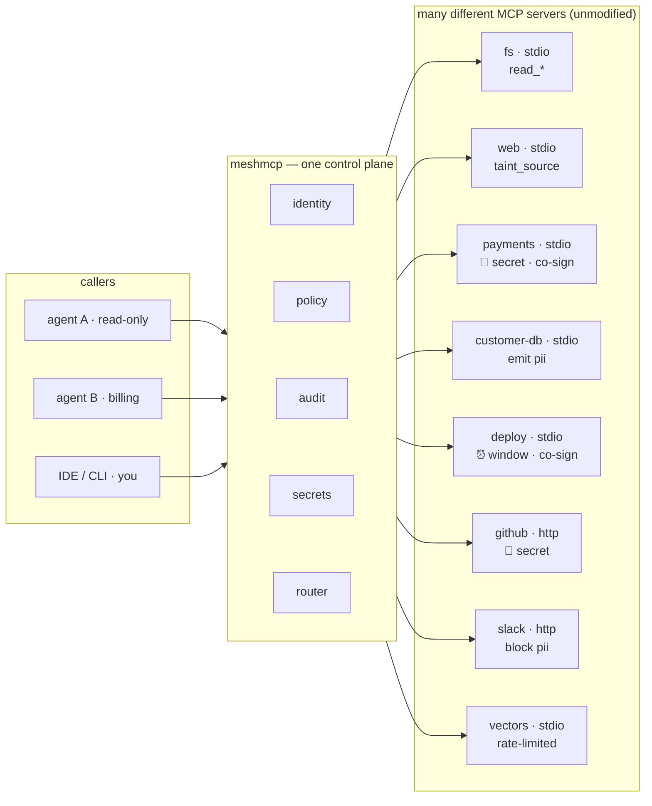

<div align="center">

# 🕸️ meshmcp

### The identity-native control plane for agent-to-tool traffic

Expose any [Model Context Protocol](https://modelcontextprotocol.io) server as a **dark service** —
reachable only over a private WireGuard mesh, with **zero open ports**, a cryptographic identity for
every caller, an **agent firewall** that enforces what each agent may do, and a **non-repudiable audit
log** that proves what it did.

<br>


<sub>userspace WireGuard, no TUN, no admin rights · stdio + Streamable-HTTP · one static binary</sub>

<br><br>

**[▶ Live showcase — see what's possible](https://xrey167.github.io/meshmcp/)**

</div>

---

An MCP server is normally a local stdio process or an open HTTP port. Sharing one securely across
machines means a VPN, a reverse proxy, an auth layer, an audit pipeline, and hoping the connection
holds. **meshmcp collapses all of that into one library** wrapped around any MCP server you already
have — connectivity, identity, policy, and proof, as five composable layers:

```
        clients / agents / IDEs  ──  meshmcp call · connect · your MCP client
                    │
        ════════════▼════════════  WireGuard mesh · no public ports · nmap finds nothing
        │                        │
        │  UNDERSTAND   insight   │   policy from behavior: profile · recommend · simulate · detect
        │  PROVE        audit     │   Ed25519-signed, hash-chained log · dashboard · replay
        │  ENFORCE      firewall  │   policy engine: rate · window · taint · data-flow labels · co-sign
        │  CONNECT      mesh       │   cryptographic identity · resumable + migratable sessions
        │                        │
        ════════════▼════════════
        any MCP server (stdio or HTTP), unmodified   ·   fs · fetch · db · your tools
```

Scale it out with an aggregating **router**, a managed **control plane**, and cross-org **federation**.

---

## Why it's different

Every other "MCP gateway" trusts a header or a token the caller sends. meshmcp keys everything —
policy, audit, routing — off the **WireGuard key the transport cryptographically proves**. That one
choice is the moat: a caller can't forge an identity it doesn't hold the private key for, so the
firewall can't be talked past and the audit can't be repudiated.

| | |
|---|---|
| 🔒 **Zero exposure** | Backends listen only on the mesh interface. No public port to scan, phish, or DDoS. |
| 🪪 **Cryptographic identity** | Every request resolves to the caller's WireGuard public key + mesh FQDN — the root of policy and audit, not a claim. |
| 🔁 **Sessions that survive** | Exactly-once, in-order delivery over a bounded, flow-controlled buffer; survives client roaming **and** a gateway crash (shared store + ownership lease). |
| 🧱 **The agent firewall** | Allow/deny per tool & method by identity, **rate limits**, **time windows**, **human co-sign**, and **data-flow labels** — enforced where no jailbreak can reach it. |
| 🧾 **Non-repudiable audit** | Every decision is a hash-chained record sealed by **Ed25519-signed Merkle checkpoints** — provable complete-and-unedited with the public key alone. |
| 🧠 **Policy from behavior** | `insight` profiles what agents actually do, **generates** a least-privilege policy, **simulates** changes against real traffic (CI gate), and **detects** drift. |
| 🔑 **Credential broker** | Agents reference a secret by name (`{{secret:stripe_key}}`) and **never hold the value** — the gateway injects it by identity, audits the use (name, never value), and refuses injection into a tainted session. |
| 🌐 **Scale & federate** | Aggregating router (LB · failover · discovery · bidirectional MCP), a managed control plane, and identity-mapped cross-org federation. |

---

## One plane, many MCP servers

meshmcp isn't a server — it's the layer **in front of** your servers. A filesystem,
a web-fetcher, a payments API, a customer database, a deploy pipeline: each is a
**different** MCP server, wrapped unmodified. Every call to **any** of them gets the
same identity, policy, audit, and secret injection — and the router can union them
into one namespaced endpoint.



Each server keeps its own nature — different tools, transports, and risk. The plane
gives them a **shared** spine: one WireGuard identity per caller, one policy language,
one tamper-evident ledger, one credential broker. See the
[cookbook](docs/COOKBOOK.md) for a worked example of wrapping each one.

---

## Quick start — 60 seconds

```bash
go build -o meshmcp .
go build -o cmd/mcpserver/mcpserver.exe ./cmd/mcpserver   # the demo MCP server the config runs

export NB_SETUP_KEY=<key from app.netbird.io → Setup Keys>

# Serve a demo MCP server on the mesh — prints its mesh IP (e.g. 100.x.y.z)
meshmcp serve --config examples/demo-backends.yaml
```

From **any other machine on the mesh** — nothing is exposed to the internet:

```bash
meshmcp ls   100.x.y.z:9101                        # list tools / resources / prompts
meshmcp call 100.x.y.z:9101 add --arg a=2 --arg b=40
```

Wire a mesh MCP server into Claude Code (or any MCP client) with a stdio bridge:

```jsonc
{ "mcpServers": {
  "home-tools": {
    "command": "meshmcp",
    "args": ["connect", "--resumable", "100.x.y.z:9101"],
    "env": { "NB_SETUP_KEY": "<setup-key>" }
} } }
```

---

## The agent firewall, in one glance

Policy is declarative and keyed off cryptographic identity. This is the whole language:

```yaml
policy:
  default_allow: false                     # deny by default
  rules:
    - peers: ["*"]                          # rate-limited read access for everyone
      tools: ["read_*", "search"]
      allow: true
      rate: { max: 30, per: "1m" }

    - peers: ["pubkey:<agent-key>"]         # deploys only in business hours, one identity
      tools: ["deploy"]
      allow: true
      when: { days: [mon,tue,wed,thu,fri], hours: "09:00-17:00", tz: "UTC" }

    - peers: ["*"]                          # fetch brings untrusted data in …
      tools: ["fetch"]
      allow: true
      taint_source: true
    - peers: ["*"]                          # … so writes are blocked once tainted
      tools: ["write_file"]                 #    (prompt-injection defense, network-layer)
      allow: true
      taint_guard: true

    - peers: ["*"]                          # PII may never reach an egress tool
      tools: ["read_customer"]
      allow: true
      emit_labels: ["pii"]
    - peers: ["*"]
      tools: ["post_external"]
      allow: true
      block_labels: ["pii"]

    - peers: ["*"]                          # money movement needs a human co-sign
      tools: ["transfer_funds"]
      allow: true
      require_cosign: true
```

A denied call gets an inline JSON-RPC error; a `require_cosign` call is held until a human approves it
(`meshmcp approve …`). Don't want to write this by hand? **Generate it from real traffic:**

```bash
meshmcp insight recommend audit.jsonl > policy.yaml     # least-privilege policy from behavior
meshmcp insight simulate  audit.jsonl --policy policy.yaml   # CI gate: exit ≠ 0 on regressions
```

---

## Prove what happened

The audit log is a tamper-evident hash chain, sealed by signed Merkle checkpoints:

```console
$ meshmcp audit verify audit.jsonl --checkpoints cps.jsonl --pubkey <key>
OK  1240 records, 10 signed checkpoint(s), 1240 records committed
    non-repudiable: the log is complete and unedited, provable with the public key alone
```

Edit a single record — even re-linking the whole chain — and verification fails at the exact
sequence number. An insider with write access to the file still can't forge it without the key.
Watch it live with `meshmcp dash --audit audit.jsonl`; re-run a past session with `meshmcp replay`.

---

## Commands

| Command | What it does |
|---|---|
| `serve --config <f>` | Join the mesh; expose configured backends on mesh ports. |
| `router --config <f>` | Aggregate upstreams into one namespaced endpoint (LB · failover · discovery · bidi MCP). |
| `orchestrate --config <f>` | Serve a tool that calls other servers' tools over the mesh. |
| `control [flags]` | Managed control plane: node enrollment (NetBird key issuance), registry, policy distribution. |
| `federate --config <f>` | Cross-org boundary: bridge granted tools between meshes, identity-mapped & audited. |
| `connect [flags] <peer:port>` | Stdio ⇄ remote stdio bridge for MCP client configs (`--resumable`). |
| `forward <local> <peer:port>` | Forward a local TCP port to a mesh peer (for HTTP backends). |
| `ls · call · read · prompt <peer:port>` | Drive tools / resources / prompts from the terminal. |
| `insight profile·recommend·simulate·detect` | Turn the audit stream into policy; detect drift. |
| `audit verify <f> [--checkpoints --pubkey]` | Verify a log: hash chain, or signatures + Merkle. |
| `audit keygen [--out f]` | Generate a gateway Ed25519 signing key. |
| `approve --store <d> <peer> <tool>` | Human co-sign a held `require_cosign` call. |
| `secrets check --config <f>` | Validate the credential broker config (never prints values). |
| `dash --audit <f>` | Serve the live control dashboard. |
| `room --audit <f>` | Serve the live **Control Room** — server tiles, agent apps, streaming decision feed. |
| `agent --role <r> <peer:port>` | Run a demo agent app (reader/fetcher/billing/analyst) with its own mesh identity. |
| `replay [--fork N] <trace> <peer:port>` | Re-issue a traced session and diff every response. |
| `probe [--full\|--task] <peer:port>` | In-process MCP handshake diagnostic. |

<sub>Shared mesh flags: `--setup-key` (`$NB_SETUP_KEY`) · `--management-url` · `--device-name` · `--nb-config` · `--wg-port`</sub>

---

## Design invariants

1. **No open ports, ever** — backends listen only on the mesh interface.
2. **Identity is cryptographic, never claimed** — authz keys off the WireGuard key the transport proves, not a header the caller sends.
3. **Deny is the safe default** — policies are allowlists; an unopenable audit sink is a hard error.
4. **Pure transport where possible** — the gateway parses MCP only to authorize; any MCP server runs unmodified.

---

## Project layout

```
session/     resumable + migratable session layer (Mars-STN-style reliability · store · lease · flock)
policy/      the agent firewall (enforce): policy engine, signed tamper-evident audit, trace, replay
insight/     the firewall's read side (understand): profile · recommend · simulate · detect
secrets/     credential broker: inject secrets by identity, agent never holds the value
control/     managed control plane: enrollment (NetBird key issuance) · registry · policy distribution
federation/  cross-org boundary: per-org tool grants · identity mapping · audited crossings
mcp/         dependency-free MCP server framework (tools · resources · prompts · tasks · HTTP)
mcpclient/   MCP client over any transport (used by the router, orchestrator, CLI)
registry/    file-based discovery registry
cmd/         mcpserver (demo) · mcpecho · mcphttp
*.go         the meshmcp binary: serve · router · orchestrate · control · federate · insight · … · CLI
examples/    ready-to-adapt configs        docs/  design docs + open specs
```

## Docs & specs

- **[docs/DEMO.md](docs/DEMO.md)** — the live mesh demo: one gateway, four MCP servers, four agent apps, watched in the Control Room.
- **[docs/COOKBOOK.md](docs/COOKBOOK.md)** — 10 worked "what's possible" scenarios, each with copy-paste config and a diagram.
- **[examples/](examples/)** — annotated configs for every scenario (start with `agent-firewall.yaml`).
- **[docs/AGENT-FIREWALL.md](docs/AGENT-FIREWALL.md)** — the policy engine, signed audit, dashboard, replay, control plane, federation.
- **[docs/INSIGHT.md](docs/INSIGHT.md)** — the firewall's read side: observe → recommend → simulate → detect.
- **[docs/SECRETS.md](docs/SECRETS.md)** — the credential broker: identity-gated secret injection, the agent never holds the value.
- **[docs/spec/](docs/spec/)** — open specs: the [audit-record format](docs/spec/AUDIT-RECORD.md) and the [policy DSL](docs/spec/POLICY-DSL.md), each with a JSON Schema.
- **[docs/MOBILE.md](docs/MOBILE.md)** — how the whole stack could reach phones (a phone is a human identity on the mesh — the natural co-sign approver).
- **[docs/HA-TOOLMESH.md](docs/HA-TOOLMESH.md)** · **[docs/reference.md](docs/reference.md)** · **[docs/VISION.md](docs/VISION.md)** — HA design, full reference, roadmap.

## Build & test

```bash
go build ./... && go vet ./... && go test ./... -race
```

## License

**Proprietary — all rights reserved.** The source is public for reading only.
Any use — running, deploying, copying, modifying, or redistributing — requires
prior written permission from the copyright holder, **Rey Darius**. Ask first.
See [LICENSE](LICENSE).

<div align="center">
<br>
<sub>Built on the reliability idea behind Tencent Mars STN, the embedding pattern from caddy-netbird, and NetBird's userspace WireGuard.</sub>
</div>
