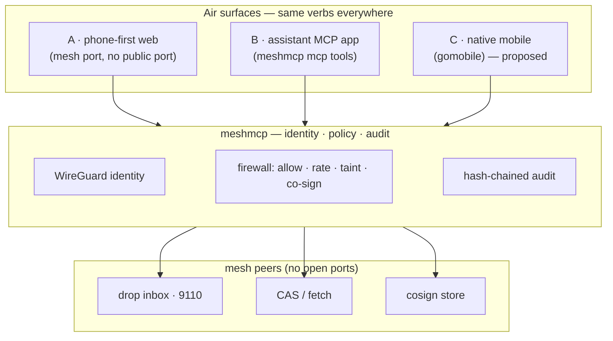

# Air — the coherent agent experience on meshmcp

**Air** is one name and one product surface for meshmcp's payload + human-in-the-loop
layer: see verified agents/devices in **Nearby**, **continue** a privacy-safe Activity,
**drop** a file, **push** a snippet or task, **fetch** a blob by content hash,
**steer** live work (an agent, session, or task), **handoff** bounded active-work context
to another device, **launch** a fresh agent, and **approve** a held call — from a phone,
an assistant, or a laptop.

Air aims for the coherence of an integrated consumer platform: one identity, a small
shared vocabulary, predictable continuity, and privacy by default. It uses meshmcp's
own protocols and interaction model; it does not implement or imitate Apple's AirDrop
protocol or visual design. meshmcp is independent and is not affiliated with or
endorsed by Apple Inc.

Every Air transfer is between **cryptographic identities on a dark mesh** — no public
application ingress and no caller-supplied identity — is **resumable** across a network
roam, is **policy-gated** by the receiver's firewall, and is recorded in the
tamper-evident ledger. Air asks two separate questions: “which identity did the
transport prove?” and “may that identity do this?”

> Air is a coherent face over primitives meshmcp already ships (`peers`, `drop`, `push`,
> `fetch`, `approvals`) plus the **steer** and **launch** primitives built on top — the agent
> steer inbox, session enumeration + a line-safe session steer, `tasks/steer`, the gateway
> control endpoint, and the `meshmcp air` CLI. See
> [docs/AIR-STEER.md](AIR-STEER.md) for how steer/launch are built and
> [docs/AIR-CONTINUITY.md](AIR-CONTINUITY.md) for Handoff's trust boundaries, then
> [§6](#6--whats-real-today-vs-proposed) for the full real-vs-proposed table.

---

## 1 · What Air is

meshmcp's moat is that the **same WireGuard key that identifies the caller for tool
authorization also stamps a dropped file, a pushed task, and a co-sign**. So “who sent
what to whom, and who approved it” starts from a transport-proved identity—not a
header or body claim. Policy still decides what that identity may do. Air is the
consumer-facing product of that separation.

| Air action | Backed by (exists today) | One line |
|---|---|---|
| **Nearby** — which agents/devices are ready | `air/presence.go` · `aircontrol.go` · `airnearby.go` | The transport stamps identity and observed address; a short-lived card advertises availability, services, and optional Activity metadata. |
| **Discover** — who's on my mesh and what can I use | `peers.go` · `air/catalog.go` · `client.Status()` | Peer identity plus per-caller Component Cards; discovery never grants access. |
| **Drop** — send files | `drop.go` (`sendFiles`, `session` client) | Resumable, E2E-encrypted, sender-ACL gated, content-hash audited. |
| **Push** — send clipboard / a task | `push.go` (`sendData`) | A small stdin payload to a peer's resumable inbox, by identity. |
| **Fetch** — pull by content hash | `cas.go` · `fetch` | Zero-exposure content-addressed retrieval from a peer's store. |
| **Steer** — drive live work | `agent.go` · `session/server.go` · `mcp/tasks.go` · `aircontrol.go` | Send/cancel/nudge to an agent (steer inbox), a session (line-safe server→client notify), or a task (`tasks/steer`). |
| **Handoff** — continue elsewhere | `air/handoff.go` · `airhandoff.go` · `airhandoff_store.go` | Offer an inert, exact-key-bound Context Capsule; the destination explicitly accepts and chooses the governed continuation tool. |
| **Launch** — spawn agent / workflow | `air.go` · `airworkflow.go` | Start a new agent (`roleScripts`) or run a declarative workflow as its own mesh identity. |
| **Approve** — co-sign a held call | `approvals.go` · `policy.FilePending` | The phone is the human identity the firewall was waiting for. |
| **Prove** — receipts | `audit.go` · `policy/` | Governed network decisions produce hash-chained (optionally signed) records; local-only state and separately configured sinks are described per verb. |

---

## 2 · The verbs, grounded

Each Air verb maps to a command that runs **today**. Air is the surface that makes them
feel like one thing.

### Discover
```bash
meshmcp peers            # connected identities — the "who can I drop to" view
meshmcp peers --all      # include offline peers
meshmcp air whoami       # the mesh identity a gateway's allow-list + audit see me as
meshmcp air nearby 100.x.y.z:9600                         # verified agents/devices + live Activities
meshmcp air nearby 100.x.y.z:9600 --resolve analyst --service steer
meshmcp air node 100.x.y.z:9600 --name analyst --kind agent \
  --service steer=9120,task,nudge --activity-id research \
  --activity-title "Customer research" --progress 68      # heartbeat until Ctrl-C
meshmcp air catalog 100.x.y.z:9600   # what backends can I reach on this gateway?
meshmcp air map 100.x.y.z:9600       # your reachable mesh as a tree (you → gateway → backends)
meshmcp air browse 100.x.y.z:9101    # what tools/resources/prompts a backend exposes
meshmcp air stream ./audit.jsonl     # watch governed Air activity live (tail the ledger)
meshmcp air vision ./inbox           # images the mesh dropped here (view them on a phone via serve --gallery)
meshmcp air bind binds.yaml --audit ./audit.jsonl   # fire governed reactions when audit records match (a la rebind)
```

Discovery has a further horizon — **vision**, **stream**, **browse**, **bind**,
**computer-use**, and **phone-use** — each grounded in the same identity + firewall + ledger.
`air browse`, `air stream`, `air vision` (with the served page's Vision gallery), and `air
bind` are the first four concrete steps; see [AIR-VISION.md](AIR-VISION.md) for the full arc.

`air map` composes `whoami` and the catalog into a topology view — a tree of *you → the
gateway → the backends you may reach*. Component Card v1 gives the map and the other Air
views one vocabulary for stable ID, kind, version, owner, features, and lifecycle, rather
than treating an address or display name as the component's identity (`airmap.go`).
Peer rows come straight from the mesh (`client.Status()` in `peers.go`): status, mesh IP,
FQDN, short public key. The identity is the transport's, so it can't be spoofed.

**Nearby** turns those low-level peers into product-facing nodes. A caller authors only a
bounded `Announcement` (friendly name, availability, labels, service ports, and optional
Activity); `POST /v1/presence` stamps the full transport-verified key/FQDN and reconstructs
each service address from the observed source IP. `air node` refreshes the bounded TTL and
leaves cleanly; crashes disappear on expiry. `air nearby`, Home, the live web page, and the
assistant's `air_nearby` tool all render the same JSON. Presence is discovery metadata, never
authorization: every resolved action still enters the destination service's ACL and policy.

**Air catalog** adds an ARD-style (Agentic Resource Discovery) well-known document —
`GET /.well-known/ai-catalog.json`, served on the gateway's control port — so a peer can
ask a gateway "what can I reach here?" and get back the backends *its own identity is
permitted to use*. New catalogs advertise schema `com.meshmcp.air.catalog/v1`; each endpoint
can carry a Component Card while legacy `resumable`/`steerable` booleans remain compatible.
The standard features emitted when applicable are `mcp.2025-06-18`, `air.browse.v1`,
`air.resume.v1`, `air.steer.v1`, and `authz.capability.v1`.

**A card advertises; it never authorizes.** `owner` is descriptive metadata, not a
replacement for the identity proved by the live WireGuard transport. A feature is a
support claim, not a capability token. The list is filtered per-caller by each backend's
ACL, an unidentifiable peer discovers nothing, every read is audited (`air/catalog`), and
the real operation passes policy again at its enforcement point. See
[ECOSYSTEM.md](ECOSYSTEM.md) for the complete Component Card contract and roadmap.

**Discover from a domain name (ARD legs 2–3).** So a peer can find a gateway from *just a
domain*, `meshmcp air dns <domain> --control <mesh-ip:port>` prints the DNS records to
publish — a `_catalog._agents.<domain>` TXT pointing at the well-known catalog URL and an
`_air._tcp.<domain>` SRV for the control endpoint. `meshmcp air catalog --resolve <domain>`
then discovers the gateway: it follows the TXT pointer (leg 2) when present, otherwise
falls back to the SRV record (leg 3), builds the well-known catalog URL from the resolved
host:port, and fetches it over the mesh. meshmcp doesn't run DNS (`air dns` only prints
records for the operator to publish), and the pointer is a public-ish record — the catalog
it points to is still mesh-only and identity-gated.

**Module layout.** Air's portable, mesh-independent core lives in the [`air`](../air)
package, tested on its own:
- `air/component.go` · `air/catalog.go` — Component Card vocabulary plus the discovery
  `Catalog`/`CatalogEntry` model (`Resolve`, `Supports`, `Steerable`, and `Resumable`).
- `air/discovery.go` — ARD record generation + TXT/SRV parsing & resolution, with input
  validation that refuses zone-record injection and caps the untrusted URL.
- `air/change.go` — stable-ID-aware component changes.
- `air/presence.go` — versioned Presence + Activity cards, TTL registry, verified address
  stamping, stable normalization, and exact name/FQDN/full-key service resolution.
- `air/home.go` — the shared Home read model and deterministic change signature over
  component and Presence metadata used by CLI and web.
- `air/steer.go` — the steer envelope, its `Validate()`, the `Task`/`Nudge`/`Cancel`
  constructors, and the newline-JSON `ParseEnvelopes`/`WriteEnvelope` framing.
- `air/target.go` — the `Target` addressing grammar (`agent|session|task|group`).
- `air/workflow.go` — the declarative workflow schema, its validation, and `${var.field}`
  expansion (the runner that executes it against a live mesh stays in the main package).

The command-line and HTTP wiring that binds those to a live mesh — the `air` CLI verbs, the
served page, the gateway control endpoint's per-caller filtering, and the workflow runner —
lives in the main package and imports `air` (reading the same names through thin aliases in
`airalias.go`). So the reusable Air model can be tested and evolved independent of the mesh,
policy, and session layers.

### Drop
```bash
meshmcp drop 100.x.y.z:9110 ./report.pdf ./photo.png     # send files to a peer
meshmcp drop --config examples/drop.yaml                 # run a receiver (mesh port 9110)
```
The receiver joins the mesh, listens **only** on the mesh interface, admits only
senders matching its `allow` ACL (FQDN glob or exact pubkey), verifies each file's
content hash on landing, and writes one audit record per file (`drop.go`,
`examples/drop.yaml`). A roam mid-transfer resumes — that's the `session/` layer.

### Push
```bash
echo "meet at 15:00"  | meshmcp push 100.x.y.z:9110         # universal clipboard
pbpaste               | meshmcp push --name clip.txt 100.x.y.z:9110
task.json             | meshmcp push 100.x.y.z:9110         # hand a task to an agent
```
`push` streams a small payload from stdin to the **same** drop inbox over the same
resumable, audited channel (`push.go`). Anything on one device's clipboard — or a task
for an agent — lands on another by identity.

### Fetch
```bash
meshmcp fetch 100.x.y.z:9101 <sha256>      # pull a blob by content hash from a peer's CAS
```
Content-addressed and zero-exposure: you ask for a hash, the peer's store answers over
the mesh (`cas.go`). Nothing is published; the corpus never leaves its owner's boundary.

### Steer — address and drive live work *(shipped — [AIR-STEER.md](AIR-STEER.md))*

`push` hands a payload to a passive **inbox**; **Steer** addresses **live work** and acts
on it. Three target types, one vocabulary:

| Target | Addressed by | Backed by the seam |
|---|---|---|
| **Agent** | mesh FQDN / registry name (`peers.go`, `registry/`) | the agent **inbox** — `--steer-port` + `air agent-steer` (**shipped**, the `drop` receiver pattern on `agent.go`) |
| **Session** | 16-byte session id (`session/`) | `SessionStore.List` + `Server.Sessions` + a line-safe `Server.Steer` server→client notification (**shipped**) — *not* raw `endpoint.Send` |
| **Task / subagent** | task id (`mcp/tasks.go`) | a governed `tasks/steer` (**shipped**), symmetric with the existing `tasks/cancel` |

One CLI verb per target, as shipped:

```bash
meshmcp air sessions 100.64.0.2:9600                     # list live sessions on a gateway
meshmcp air steer 100.64.0.2:9600 --backend fs --session 9f2a \
    --param text="re-read customer 42"                   # steer a live session
meshmcp air agent-steer 100.64.0.9:9120 --type task --tool read_customer --arg id=42
meshmcp air agent-steer 100.64.0.9:9120 --type nudge --text "focus on the API"
meshmcp air tasks 100.64.0.2:9101                        # list a backend's async tasks
meshmcp air task-steer 100.64.0.2:9101 --task 7b1c --text "focus on the API"
meshmcp air task-steer 100.64.0.2:9101 --task 9f2a --cancel
```

*(A `group:<name>` broadcast — one steer fanned out as N audited records — is a
roadmap idea, not shipped; see [§7](#7--roadmap).)*

The addressing (`peers`, registry, `<name>.<tool>` namespacing, origin `_meta`) and the
transports (bidirectional MCP `Server.Request`, MCP Tasks) **already exist**. **Shipped:** the
`tasks/steer` method + `Client.SteerTask` (task augment, the counterpart to `tasks/cancel`),
the **session core** (`SessionStore.List`, `Server.Sessions`, line-safe `Server.Steer`), the
**gateway control endpoint** (`/v1/sessions`+`/v1/steer`, identity-gated + audited), the
`air_*` assistant tools, and the **`meshmcp air` CLI** (`sessions` · `steer` · `launch`).
All of this ships today. Every steer is deny-by-default, identity-attributed, and audited —
it cannot bypass the firewall. See [AIR-STEER.md](AIR-STEER.md) for the spec.

### Handoff — continue active work on another agent device

```bash
# Destination: receive inert offers from an allowed source identity.
meshmcp air handoff receive --inbox ~/.meshmcp/handoffs \
  --nb-config ~/.meshmcp/handoff-destination.json --port 9140 \
  --allow 'pubkey:<source-key>'

# Source: bind the capsule to the destination's exact WireGuard key.
meshmcp air handoff offer --nb-config ~/.meshmcp/handoff-source.json \
  --target-key '<destination-key>' \
  --work task:task-17 --goal 'Continue the outage analysis' 100.64.0.22:9140

# Destination: consent first, then choose the importing tool locally.
meshmcp air handoff accept --inbox ~/.meshmcp/handoffs <handoff-id>
meshmcp air handoff continue --inbox ~/.meshmcp/handoffs \
  --nb-config ~/.meshmcp/handoff-controller.json \
  --agent-key '<destination-agent-key>' --tool resume_analysis \
  <handoff-id> 100.64.0.31:9120

# Only after checking an unknown dispatch downstream:
meshmcp air handoff rearm --inbox ~/.meshmcp/handoffs \
  --note 'no matching agent receipt' <handoff-id>
```

Handoff moves bounded context and content-addressed references, not authority:
the receiver derives the source from the mesh transport, never auto-executes an
offer, pins the receiver-selected agent IP to `--agent-key`, claims a durable
`dispatching` state, and sends the accepted capsule back through the ordinary
steer path. Advisory `handoff`/`untrusted-context` handling hints are tool
arguments, not `policy.Filter` taint labels. Gateway policy applies when that
agent uses a governed meshmcp gateway. Secret references may travel; the sender
must not place secret values or source-bound grants in free-form fields.

This is application-level continuation in a fresh agent/session. It deliberately
does not weaken `session.Server`'s same-`CreatorKey` reattachment rule or claim
cross-device live session migration. See [AIR-CONTINUITY.md](AIR-CONTINUITY.md).

### Launch — spawn an agent or a workflow

```bash
meshmcp air launch --role reader 100.x.y.z:9101          # spawn a new agent identity
meshmcp air workflow examples/air-workflow.yaml          # run a declarative multi-step workflow
```

An agent launch child-execs `meshmcp agent` (reusing `roleScripts`) with a fresh
`--nb-config`, so the new worker joins as its own WireGuard key and immediately shows up in
`discover` and the sessions view. A **workflow** is a small declarative file (launch these
agents, steer these sessions, call these tools — run in order), run by `airworkflow.go` which
reuses the orchestrator's dial→`CallTool` shape. A launch with `steer_port` must also name at
least one allowed controller in its `steer_allow` list; those identities are passed to the
child as repeatable `--steer-allow` flags. Launch itself is a local child-process action,
not a remote control-plane call, so it has no caller ACL or launch audit record. The spawned
identity's later gateway calls are subject to the same firewall as any caller.

### Approve
```bash
meshmcp approvals --store ./demo/cosign     # phone-first co-sign inbox, served on a mesh port
```
When the firewall holds a `require_cosign` call, it records a pending request
(`policy.FilePending`). `approvals` serves a responsive page plus `GET /v1/pending`,
`POST /v1/approve`, `POST /v1/deny` — **on the mesh**, so the approver is the caller's
own WireGuard identity. Approving writes an attributed grant (`approver: <your-fqdn>`)
and the held call proceeds. This is the killer phone use case, and it works today (see
[docs/MOBILE.md §2](MOBILE.md)).

---

## 3 · Three surfaces, one experience

Air is the same verbs wherever you are. The three surfaces differ only in how you
reach them.

### A · Phone-first web over the mesh — *ships fastest*

One responsive page on a **mesh port, no public port**, opened from any device already
on the mesh — exactly the pattern `meshmcp approvals` and `meshmcp room` already use.
Zero install: a phone joined via the NetBird app opens `http://<gateway-mesh-ip>:<port>`
and gets Nearby / Drop / Push / Steer / an identity-preserving Approvals
link-out / Receipts.

The shipped [`cmd/meshmcp/site/air-live.html`](../cmd/meshmcp/site/air-live.html) is that
surface: one responsive Agent-OS shell for Continue Working, Nearby, Activities, Share,
Security, and advanced media/receipt views. It reuses:
- the peer list shape from `peers.go`,
- explicit file selection plus the relay-backed Push/Drop delivery paths,
- the pending summary plus a direct link to `approvals.go`, where the browser
  keeps its own mesh identity for the actual approve/deny decision,
- the audit-record fields from [`docs/spec/AUDIT-RECORD.md`](spec/AUDIT-RECORD.md).

```
 phone / laptop (mesh peer · own WireGuard identity)
   │  opens http://<gateway-mesh-ip>:<air-port>   (no public port)
   ▼
 meshmcp air   ── serves Nearby · Drop · Push · Steer · Approvals link-out · Receipts
   │  reads peers / sessions / receipts · relays Push / Drop / Steer · links Approvals
   ▼
 gateway: policy · audit · secrets  ──▶  peers / drop inboxes / CAS / agents · sessions · tasks
```

### B · The assistant MCP app — *Air from Claude Code / Codex*

`meshmcp mcp` already runs meshmcp as an MCP server so an assistant can operate the
mesh as governed tool calls (`mcpapp.go`, [docs/MCP-APP.md](MCP-APP.md)). It already
exposes the Air-shaped tools **`drop_file`**, **`network`**, **`pending_approvals`**,
and **`approve`/`deny`**. The **shipped** Air tools (pass `--control <gateway-ip:port>` for
the session ones) wrap the same commands the way `drop_file` wraps `drop`:

| Tool | Status | Wraps | Assistant can say |
|---|---|---|---|
| `air_catalog` | ships | `GET /.well-known/ai-catalog.json` → `air.FetchCatalog` | "What backends can I reach here?" |
| `air_sessions` | ships | `GET /v1/sessions` → `Server.Sessions()` | "List the live sessions." |
| `air_steer` | ships | `POST /v1/steer` → `Server.Steer` | "Steer session 9f2a on fs to re-read customer 42." |
| `air_tasks` | ships | `mcpclient.ListTasks` | "What tasks are running on the analyst?" |
| `air_task_steer` | ships | `mcpclient.SteerTask` → `tasks/steer` | "Nudge task-17 to focus on the API." |
| `air_peers` · `air_push` · `air_fetch` | ships | `client.Status()` · `sendData` · `fetchBlob` | "Who's on the mesh?" / "Push this task." / "Fetch blob `<sha>`." |
| `air_launch` | ships (opt-in) | `spawnAgent`, gated by `--allow-launch` | "Launch a reader agent." |

Agent-target steer is the `meshmcp air agent-steer` CLI; `air_launch` is **off by default** —
start the app with `--allow-launch` to let the assistant spawn agent processes.

Config is unchanged from the existing app:
```jsonc
{ "mcpServers": {
    "meshmcp": {
      "command": "meshmcp",
      "args": ["mcp", "--audit", "./demo/audit.jsonl", "--cosign-store", "./demo/cosign"],
      "env": { "NB_SETUP_KEY": "<your-reusable-setup-key>" }
} } }
```
Then, in the assistant: *"AirDrop report.pdf to Rey's phone"* → `drop_file`;
*"list the live sessions"* → `air_sessions`; *"steer session 9f2a on fs to re-read customer
42"* → `air_steer`; *"nudge task-17 to focus on the API"* → `air_task_steer`;
*"approve the transfer for billing.mesh"* → `approve`. Every one is a governed mesh
client — audited, firewalled, never a backdoor.

### C · Native mobile (gomobile) — *the milestone*

The richest Air surface is a native app that binds meshmcp's Go client into iOS/Android
via `gomobile`, per the surface sketched in [docs/MOBILE.md §3](MOBILE.md). Air is the
app that binding powers: a Face-ID-gated **Approve**, a **Receive** sheet for incoming
drops, a share-sheet **Drop/Push**, all with roaming-proof `session/` connections and
the WireGuard key in the secure element. This is a design target here, not this task's
build — but the binding surface (`Join`, `Dial`, `Call`, `Approvals`) is already
specified.

---

## 4 · Architecture



Nothing in the gateway, policy, or audit changes for Air. A phone or laptop joining the
mesh gets its own WireGuard key → its own cryptographic identity → policy and audit
already distinguish it. Air is just a nicer door onto the same rooms.

---

## 5 · Security model

Air inherits meshmcp's invariants and the phone-approver model from
[docs/MOBILE.md §5](MOBILE.md):

- **Zero open ports.** Every Air surface listens only on the mesh interface. `nmap` on
  the public internet finds nothing.
- **Identity is cryptographic, never claimed.** A drop/push/approve resolves to the
  sender's WireGuard key + FQDN — the root of the receiver's `allow` ACL and of every
  audit record.
- **Key in the secure element (phone).** The device's WireGuard private key sits in the
  Secure Enclave / StrongBox; the mesh identity is as strong as the hardware.
- **Biometric before the action, not the tunnel.** Gate `Approve` (and, if you like,
  `Drop`) behind Face ID / fingerprint, so a stolen unlocked phone still can't act.
- **Sender ACL + taint on drops.** The receiver admits only `allow`-listed identities
  (FQDN glob or pubkey), verifies each file's content hash, and can refuse a drop into a
  tainted session — the same firewall vocabulary as tool calls (`drop.go`, `policy/`).
- **The device never holds a secret.** Air moves files, payloads, and *references* to
  actions; credential injection stays server-side (see [docs/SECRETS.md](SECRETS.md)).
  Losing the device loses an approver/endpoint, not a credential.
- **Tamper-evident governed receipts.** Network decisions such as drops and attributed
  co-signs can be recorded in a hash-chained ledger. Completeness still depends on the
  configured fail-closed audit boundary; local UI/inbox state is not itself a signed receipt.
- **Instant revocation.** Remove the device's key from NetBird and it's off the mesh: it
  can no longer discover, drop, push, fetch, or approve.

---

## 6 · What's real today vs. proposed

Honesty about the seam, so nobody mistakes the mockup for shipped product:

| Piece | Status | Where |
|---|---|---|
| **Component Card v1** — stable ID · kind · version · owner · deterministic features · lifecycle; legacy catalogs remain readable | **Ships now (Labs discovery metadata)** | `air/component.go` · `air/catalog.go` · `air/change.go` · `air/home.go` · [ECOSYSTEM.md](ECOSYSTEM.md) |
| Verified Presence + Activity cards, bounded TTL registry, friendly service resolver | **Ships now** | `air/presence.go` · `cmd/meshmcp/aircontrol.go` · `cmd/meshmcp/airnearby.go` |
| Nearby/Home parity across terminal, responsive web, and assistant tool `air_nearby` | **Ships now** | `air/home.go` · `cmd/meshmcp/airhome.go` · `cmd/meshmcp/airserve.go` · `cmd/meshmcp/mcpapp.go` |
| `discover` / `drop` / `push` / `fetch` / `approvals` CLI | **Ships now** | `peers.go` · `drop.go` · `push.go` · `cas.go` · `approvals.go` |
| Resumable, E2E, sender-ACL, per-file audit on transfers | **Ships now** | `session/` · `drop.go` · `policy/` |
| Assistant Air tools `drop_file` · `network` · `pending_approvals` · `approve`/`deny` | **Ships now** | `mcpapp.go` · [MCP-APP.md](MCP-APP.md) |
| Phone-first web over the mesh (approver + room) | **Ships now** | `approvals.go` · `room.go` |
| `site/air.html` public interactive concept | **Preview** | `site/air.html` |
| **Steer** — P3 task augment · P2 session core · P1 agent inbox | **Ships now** | `mcp/tasks.go` · `session/server.go` · `agent.go` · `steerinbox.go` (+ tests) |
| **Steer** — gateway `/v1/sessions`+`/v1/steer` endpoint · `air_sessions`/`air_steer`/`air_tasks`/`air_task_steer` tools | **Ships now** | `config.go` · `serve.go` · `aircontrol.go` · `mcpapp.go` · `aircontrol_test.go` |
| **Steer** — control endpoint hardening: per-backend ACL re-check · steer-method allowlist · relay-attested web attribution (`X-Air-On-Behalf`) | **Ships now** | `aircontrol.go` · `serve.go` · `airserve.go` · `aircontrol_test.go` |
| **Steer/Launch** — the `meshmcp air` CLI (`sessions --json` · `steer` · `launch` · `agent-steer --target/--id` · `tasks` · `task-steer` · `workflow`) + P4 runner | **Ships now** | `air.go` · `airworkflow.go` · `examples/air-workflow.yaml` |
| **Workflow** — variables between steps (`as:` + `${var.field}`) · `parallel:` blocks · `on_error` · per-step `timeout` · `--json` summary · launch-race retry | **Ships now** | `airworkflow.go` · `airworkflow_test.go` |
| **Handoff / Continuity v1** — exact-key-pinned device + agent hops · target-bound Context Capsule · deny-by-default receiver ACL · bounded application ACK/NACK · durable inbox · explicit accept/decline · atomic dispatch claim · destination-selected continuation · durable attempt receipts | **Ships now** | `air/handoff.go` · `airhandoff.go` · `airhandoff_store.go` · [AIR-CONTINUITY.md](AIR-CONTINUITY.md) |
| Assistant tools `air_peers` · `air_push` · `air_fetch` · `air_launch` (opt-in) | **Ships now** | `mcpapp.go` · `mcpapp_air_test.go` |
| A served **live** Air web page over the mesh (`meshmcp air serve`) — Nearby · Sessions/Steer · **Push/Drop** (sent over the relay's identity) · **Approvals link-out** (browser keeps its own identity) · **Receipts** (`--audit` tail) · **Vision** gallery (`--gallery` inbox — image drops rendered inline, path-safe) · viewer `--allow` ACL. A phone-first, polished consumer UI (large-title header, grouped cards, segmented steer sheet, light/dark), hardened as a browser surface: strict CSP, `nosniff`/frame-deny/no-referrer headers, and a same-origin guard on every state-changing POST (CSRF / DNS-rebinding). | **Ships now** | `airserve.go` · `cmd/meshmcp/site/air-live.html` · `airserve_test.go` |
| **Vision arc** — `air browse` (backend tools/resources/prompts, identity-filtered) · `air stream` (live audit tail, decision-coloured, rotation-aware) · `air vision` (drop-inbox image inventory) · `air bind` (audit-triggered governed reactions, deny-by-default `run`) | **Ships now** | `airbrowse.go` · `airstream.go` · `airvision.go` · `airbind.go` (+ tests) · [AIR-VISION.md](AIR-VISION.md) · `examples/air-bindings.yaml` |
| Push-wake seam (device registry + notify hook) + a **webhook Notifier** delivering over the network (no vendor creds) | **Ships now** | `pushwake.go` · `webhooknotify.go` · `approvals.go` (`--notify-webhook`) · `pushwake_test.go` · `webhooknotify_test.go` — [MOBILE.md §4](MOBILE.md) |
| Native mobile **binding package** (`mobile/`, compiles; `gomobile bind` external) | **Ships now** | `mobile/mobile.go` · `mobile/mobile_test.go` — [MOBILE.md §3](MOBILE.md) |
| A shipped native mobile **app** (bound + built + on a device) | **External** | needs the iOS/Android toolchain + a device |

Invariants that never move: **no open ports**, **identity is cryptographic**, **deny is
the default**.

---

## 7 · Roadmap

The useful verbs and current Air surface ship. The broader shared ecosystem sequence—
**Trust Card + Library → Universal Resolver → explicitly accepted Continuity Capsules →
Automations → native companion**—is specified in [ECOSYSTEM.md](ECOSYSTEM.md). In
particular, continuity will not reassign a live session's identity or transfer bearer,
capability, or secret tokens.

The Agent-OS expansion makes those verbs increasingly continuous without pretending that a
network session is already a transferable agent mind. Its detailed product sequence and
security boundaries are in [AIR-ECOSYSTEM.md](AIR-ECOSYSTEM.md) and
[AIR-CONTINUITY.md](AIR-CONTINUITY.md). Native push and mobile-app delivery remain external
where they require vendor credentials or a physical device the repository cannot exercise.

1. **Done — Nearby + Activity foundation.** Component Cards, the Presence registry, friendly
   service resolver, `air nearby` / `air announce` / `air node`, Home/web integration, and
   `air_nearby` use the same versioned contracts.
2. **Done — truthful Handoff v1.** Bounded, exact-key-bound Context Capsules follow an explicit
   offer → accept → dispatch → continue lifecycle with application ACKs and durable attempt
   receipts. They move inert context and references; they do not move bearer tokens, secrets,
   capabilities, or a live session identity.
3. **Next — universal addressing and a consolidated Air Node.** Every send/control verb should
   accept a verified name/FQDN/full key plus service kind while preserving raw `host:port`.
   One node runtime should host selected inbox/ring/cast/screen/approval/steer services and
   announce them automatically.
4. **Push delivery — mostly done.** A **webhook `Notifier`** ships in-repo
   (`meshmcp approvals --devices <dir> --notify-webhook <url>`): each new pending is POSTed to
   an operator relay that fans out to APNs/FCM with its own credentials — real network delivery
   with **no vendor keys in meshmcp**. Only a *direct* in-process APNs/FCM `Notifier` (which
   would embed Apple/Google credentials) remains external ([MOBILE.md §4](MOBILE.md)).
5. **External — the shipped mobile app.** `gomobile bind ./mobile` → an iOS `.xcframework` /
   Android `.aar`, then a thin native shell (Face-ID approve, receive/share sheets). Needs the
   mobile toolchain + a device ([MOBILE.md §3](MOBILE.md)).
6. **Proposed — Spaces / `group:<name>`.** Resolve a user-owned group to its members and
   fan one steer out as one governed, audited call per member ("broadcast = N audited
   records"). Not implemented; nothing resolves a `group:` target today.
7. **Proposed — the wider Continuity ecosystem.** Add signed availability manifests,
   short-lived presence, exact-key smart targeting, scoped Spaces, unified Shortcuts,
   destination-bound grant re-issuance, and Find Work. True live migration remains a
   separate session-v2 protocol with fencing and client/backend snapshot support; see
   [AIR-CONTINUITY.md](AIR-CONTINUITY.md).

## Reference points

- `cmd/meshmcp/peers.go` · `drop.go` · `push.go` · `cas.go` — discover / drop / push / fetch.
- [AIR-STEER.md](AIR-STEER.md) — the code-ready spec for **steer** + **launch** (P1–P4),
  grounded in `agent.go`, `session/endpoint.go`, `mcp/tasks.go`, `orchestrate.go`, `router.go`.
- [AIR-CONTINUITY.md](AIR-CONTINUITY.md) — Handoff's Context Capsule, receive/accept/continue
  lifecycle, trust boundaries, and the ecosystem roadmap around it.
- `approvals.go` · `policy/pending.go` — the phone-first co-sign inbox.
- `mcpapp.go` · [MCP-APP.md](MCP-APP.md) — Air from an assistant, governed + audited.
- [MOBILE.md](MOBILE.md) — phone = a hardware-backed human identity; the push seam; the
  gomobile binding surface.
- [IDEAS.md](IDEAS.md) — the payload-layer thesis (F1 AirDrop, S2 "My Devices" vault).
- `examples/drop.yaml` — a ready-to-run drop receiver.
- [`cmd/meshmcp/site/air-live.html`](../cmd/meshmcp/site/air-live.html) — the shipped responsive Agent-OS surface.
