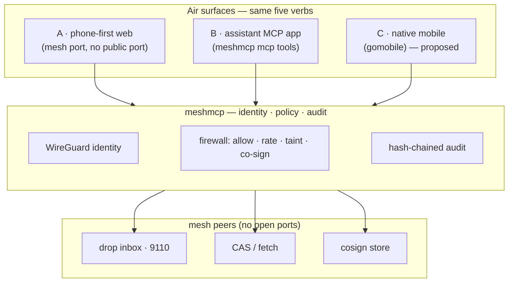

# Air — the AirDrop-native face of meshmcp

**Air** is one name and one product surface for meshmcp's payload + human-in-the-loop
layer: **discover** who's on your mesh, **drop** a file, **push** a snippet or a task,
**fetch** a blob by content hash, and **approve** a held call — from a phone, an
assistant, or a laptop.

It looks like Apple AirDrop. It is not. Every Air transfer is between **cryptographic
identities on a dark mesh** — no cloud, no accounts, no open ports — is **resumable**
across a network roam, is **policy-gated** by the receiver's firewall, and is
**provable** in a tamper-evident ledger. AirDrop asks "is this person near me?"; Air
asks "does this WireGuard key prove who they are, and may they do this?" — and writes
down the answer.

> Air is not new machinery. It's a coherent face over primitives meshmcp already
> ships (`peers`, `drop`, `push`, `fetch`, `approvals`), plus a small, clearly-marked
> set of proposed additions. See [§6](#6--whats-real-today-vs-proposed).

---

## 1 · What Air is

meshmcp's moat is that the **same WireGuard key that authorizes a tool call also
stamps a dropped file, a pushed task, and a co-sign**. So "who sent what to whom, and
who approved it" is cryptographic by construction — not a header, not a claim. Air is
the consumer-facing product of that one fact.

| Air action | Backed by (exists today) | One line |
|---|---|---|
| **Discover** — who's on my mesh | `peers.go` · `client.Status()` | Each row is a WireGuard identity + mesh FQDN, not a claim. |
| **Drop** — send files | `drop.go` (`sendFiles`, `session` client) | Resumable, E2E-encrypted, sender-ACL gated, content-hash audited. |
| **Push** — send clipboard / a task | `push.go` (`sendData`) | A small stdin payload to a peer's resumable inbox, by identity. |
| **Fetch** — pull by content hash | `cas.go` · `fetch` | Zero-exposure content-addressed retrieval from a peer's store. |
| **Approve** — co-sign a held call | `approvals.go` · `policy.FilePending` | The phone is the human identity the firewall was waiting for. |
| **Prove** — receipts | `audit.go` · `policy/` | Every Air action lands in the hash-chained (optionally signed) ledger. |

---

## 2 · The five verbs, grounded

Each Air verb maps to a command that runs **today**. Air is the surface that makes them
feel like one thing.

### Discover
```bash
meshmcp peers            # connected identities — the "who can I drop to" view
meshmcp peers --all      # include offline peers
```
Rows come straight from the mesh (`client.Status()` in `peers.go`): status, mesh IP,
FQDN, short public key. The identity is the transport's, so it can't be spoofed.

### Drop
```bash
meshmcp drop 100.x.y.z:9110 ./report.pdf ./photo.png     # send files to a peer
meshmcp drop --config examples/drop.yaml                 # run a receiver (mesh port 9110)
```
The receiver joins the mesh, listens **only** on the mesh interface, admits only
senders matching its `allow` ACL (FQDN glob or exact pubkey), verifies each file's
content hash on landing, and writes one audit record per file (`drop.go`,
`examples/drop.yaml`). A roam mid-transfer resumes — that's the `session/` layer.

### Push
```bash
echo "meet at 15:00"  | meshmcp push 100.x.y.z:9110         # universal clipboard
pbpaste               | meshmcp push --name clip.txt 100.x.y.z:9110
task.json             | meshmcp push 100.x.y.z:9110         # hand a task to an agent
```
`push` streams a small payload from stdin to the **same** drop inbox over the same
resumable, audited channel (`push.go`). Anything on one device's clipboard — or a task
for an agent — lands on another by identity.

### Fetch
```bash
meshmcp fetch 100.x.y.z:9101 <sha256>      # pull a blob by content hash from a peer's CAS
```
Content-addressed and zero-exposure: you ask for a hash, the peer's store answers over
the mesh (`cas.go`). Nothing is published; the corpus never leaves its owner's boundary.

### Approve
```bash
meshmcp approvals --store ./demo/cosign     # phone-first co-sign inbox, served on a mesh port
```
When the firewall holds a `require_cosign` call, it records a pending request
(`policy.FilePending`). `approvals` serves a responsive page plus `GET /v1/pending`,
`POST /v1/approve`, `POST /v1/deny` — **on the mesh**, so the approver is the caller's
own WireGuard identity. Approving writes an attributed grant (`approver: <your-fqdn>`)
and the held call proceeds. This is the killer phone use case, and it works today (see
[docs/MOBILE.md §2](MOBILE.md)).

---

## 3 · Three surfaces, one experience

Air is the same five verbs wherever you are. The three surfaces differ only in how you
reach them.

### A · Phone-first web over the mesh — *ships fastest*

One responsive page on a **mesh port, no public port**, opened from any device already
on the mesh — exactly the pattern `meshmcp approvals` and `meshmcp room` already use.
Zero install: a phone joined via the NetBird app opens `http://<gateway-mesh-ip>:<port>`
and gets Nearby / Drop / Push / Approvals / Receipts.

This is what [`site/air.html`](../site/air.html) mocks up — the "how it could look"
deliverable. It reuses:
- the peer list shape from `peers.go`,
- the drag-to-drop → `meshmcp drop …` interaction already in
  [`site/knowledge-canvas.html`](../site/knowledge-canvas.html),
- the pending → approve/deny flow from `approvals.go`,
- the audit-record fields from [`docs/spec/AUDIT-RECORD.md`](spec/AUDIT-RECORD.md).

```
 phone / laptop (mesh peer · own WireGuard identity)
   │  opens http://<gateway-mesh-ip>:<air-port>   (no public port)
   ▼
 meshmcp air   ── serves Nearby · Drop · Push · Approvals · Receipts
   │  calls peers / drop / push / fetch / approvals internally
   ▼
 gateway: policy · audit · secrets  ──▶  peers / drop inboxes / CAS
```

### B · The assistant MCP app — *Air from Claude Code / Codex*

`meshmcp mcp` already runs meshmcp as an MCP server so an assistant can operate the
mesh as governed tool calls (`mcpapp.go`, [docs/MCP-APP.md](MCP-APP.md)). It already
exposes the Air-shaped tools **`drop_file`**, **`network`**, **`pending_approvals`**,
and **`approve`/`deny`**. The proposed additions round out the five verbs by wrapping
the existing commands the same way `drop_file` wraps `drop`:

| Proposed tool | Wraps | Assistant can say |
|---|---|---|
| `air_peers` | `peers.go` / `client.Status()` | "Who's on the mesh right now?" |
| `air_push` | `push.go` (`sendData`) | "Push this task to the analyst agent." |
| `air_fetch` | `cas.go` / `fetch` | "Pull blob `<sha256>` from the vault." |

Config is unchanged from the existing app:
```jsonc
{ "mcpServers": {
    "meshmcp": {
      "command": "meshmcp",
      "args": ["mcp", "--audit", "./demo/audit.jsonl", "--cosign-store", "./demo/cosign"],
      "env": { "NB_SETUP_KEY": "<your-reusable-setup-key>" }
} } }
```
Then, in the assistant: *"AirDrop report.pdf to Rey's phone"* → `drop_file`;
*"who's on the mesh?"* → `air_peers`; *"anything waiting for approval?"* →
`pending_approvals`; *"approve the transfer for billing.mesh"* → `approve`. Every one
is a governed mesh client — audited, firewalled, never a backdoor.

### C · Native mobile (gomobile) — *the milestone*

The richest Air surface is a native app that binds meshmcp's Go client into iOS/Android
via `gomobile`, per the surface sketched in [docs/MOBILE.md §3](MOBILE.md). Air is the
app that binding powers: a Face-ID-gated **Approve**, a **Receive** sheet for incoming
drops, a share-sheet **Drop/Push**, all with roaming-proof `session/` connections and
the WireGuard key in the secure element. This is a design target here, not this task's
build — but the binding surface (`Join`, `Dial`, `Call`, `Approvals`) is already
specified.

---

## 4 · Architecture



Nothing in the gateway, policy, or audit changes for Air. A phone or laptop joining the
mesh gets its own WireGuard key → its own cryptographic identity → policy and audit
already distinguish it. Air is just a nicer door onto the same rooms.

---

## 5 · Security model

Air inherits meshmcp's invariants and the phone-approver model from
[docs/MOBILE.md §5](MOBILE.md):

- **Zero open ports.** Every Air surface listens only on the mesh interface. `nmap` on
  the public internet finds nothing.
- **Identity is cryptographic, never claimed.** A drop/push/approve resolves to the
  sender's WireGuard key + FQDN — the root of the receiver's `allow` ACL and of every
  audit record.
- **Key in the secure element (phone).** The device's WireGuard private key sits in the
  Secure Enclave / StrongBox; the mesh identity is as strong as the hardware.
- **Biometric before the action, not the tunnel.** Gate `Approve` (and, if you like,
  `Drop`) behind Face ID / fingerprint, so a stolen unlocked phone still can't act.
- **Sender ACL + taint on drops.** The receiver admits only `allow`-listed identities
  (FQDN glob or pubkey), verifies each file's content hash, and can refuse a drop into a
  tainted session — the same firewall vocabulary as tool calls (`drop.go`, `policy/`).
- **The device never holds a secret.** Air moves files, payloads, and *references* to
  actions; credential injection stays server-side (see [docs/SECRETS.md](SECRETS.md)).
  Losing the device loses an approver/endpoint, not a credential.
- **Non-repudiable receipts.** Every Air action is a hash-chained record — a drop's
  content hash, a push, an attributed co-sign — provable complete-and-unedited with the
  public key alone.
- **Instant revocation.** Remove the device's key from NetBird and it's off the mesh: it
  can no longer discover, drop, push, fetch, or approve.

---

## 6 · What's real today vs. proposed

Honesty about the seam, so nobody mistakes the mockup for shipped product:

| Piece | Status | Where |
|---|---|---|
| `discover` / `drop` / `push` / `fetch` / `approvals` CLI | **Ships now** | `peers.go` · `drop.go` · `push.go` · `cas.go` · `approvals.go` |
| Resumable, E2E, sender-ACL, per-file audit on transfers | **Ships now** | `session/` · `drop.go` · `policy/` |
| Assistant Air tools `drop_file` · `network` · `pending_approvals` · `approve`/`deny` | **Ships now** | `mcpapp.go` · [MCP-APP.md](MCP-APP.md) |
| Phone-first web over the mesh (approver + room) | **Ships now** | `approvals.go` · `room.go` |
| `site/air.html` unified Air mockup | **This change** (mockup only) | `site/air.html` |
| `meshmcp air` umbrella command (one page serving all five verbs) | **Proposed** | would wrap the five commands above |
| Assistant tools `air_peers` · `air_push` · `air_fetch` | **Proposed** | thin wrappers in `mcpapp.go`, like `drop_file` |
| Push-wake (buzz the phone on a new pending) | **Proposed** | the "push seam" — [MOBILE.md §4](MOBILE.md) |
| Native mobile app (gomobile) | **Proposed** | binding surface — [MOBILE.md §3](MOBILE.md) |

Invariants that never move: **no open ports**, **identity is cryptographic**, **deny is
the default**.

---

## 7 · Roadmap

Mirrors the staged path in [docs/MOBILE.md §7](MOBILE.md), Air-branded:

1. **Now — Air from the CLI and the assistant.** `peers` + `drop` + `push` + `fetch` +
   `approvals`, and the existing `meshmcp mcp` tools. Nothing new to build to *use* Air.
2. **Next — one Air page.** A `meshmcp air` command that serves the five verbs on a mesh
   port (the mockup, made real), reusing the `approvals`/`room` serving pattern, plus the
   `air_peers`/`air_push`/`air_fetch` assistant tools.
3. **Then — push-wake.** The device-registration + APNs/FCM notify seam so a phone
   *buzzes* on a pending drop or approval instead of polling ([MOBILE.md §4](MOBILE.md)).
4. **Later — the native Air app.** `gomobile`-bound identity + resumable sessions, Face-ID
   approvals, receive/share sheets ([MOBILE.md §3](MOBILE.md)).

## Reference points

- `peers.go` · `drop.go` · `push.go` · `cas.go` — discover / drop / push / fetch.
- `approvals.go` · `policy/pending.go` — the phone-first co-sign inbox.
- `mcpapp.go` · [MCP-APP.md](MCP-APP.md) — Air from an assistant, governed + audited.
- [MOBILE.md](MOBILE.md) — phone = a hardware-backed human identity; the push seam; the
  gomobile binding surface.
- [IDEAS.md](IDEAS.md) — the payload-layer thesis (F1 AirDrop, S2 "My Devices" vault).
- `examples/drop.yaml` — a ready-to-run drop receiver.
- [`site/air.html`](../site/air.html) — the visual mockup of surface A.
