# meshmcp cookbook — what's possible, by example

Worked, copy-paste scenarios. Each shows the goal, the config or commands, and a
diagram of what happens. Every scenario runs on one `meshmcp` binary; mesh
credentials come from `$NB_SETUP_KEY` or `--setup-key`.

> A visual tour of the same material: the [capabilities showcase](https://claude.ai/code/artifact/063e5ce2-bc4d-42b4-bc8e-a777a803ce75).

## One plane, many MCP servers

meshmcp isn't a server — it's the layer **in front of** your servers. A filesystem,
a web-fetcher, a payments API, a customer database, a deploy pipeline: each is a
**different** MCP server, wrapped unmodified. Every call to **any** of them gets
the same identity, policy, audit, and secret injection — and the router can union
them into one namespaced endpoint. The scenarios below each wrap **one** of these
servers; the point is that they all share the same spine.

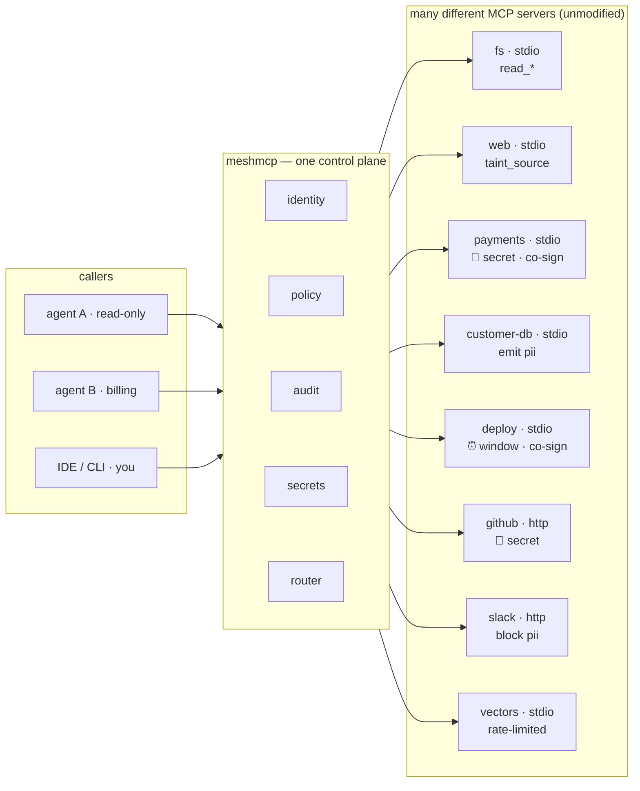

Each server keeps its own nature — different tools, transports, and risk. The
plane gives them a **shared** spine: one WireGuard identity per caller, one policy
language, one tamper-evident ledger, one credential broker.

| server | transport | example tools | governance it gets |
|---|---|---|---|
| `fs` | stdio | `read_file`, `list` | rate-limited reads (§1) |
| `web` | stdio | `fetch`, `http_get` | `taint_source` → taints the session (§2) |
| `customer-db` | stdio | `read_customer` | `emit_labels: [pii]` (§3) |
| `payments` | stdio | `charge`, `refund` | 🔑 secret injection + `require_cosign` (§4, §7) |
| `deploy` | stdio | `deploy` | time `when:` window + co-sign |
| `github` | http | `open_pr` | 🔑 secret injection |
| `slack` | http | `post_message` | `block_labels: [pii]` — egress guard (§3) |
| `vectors` | stdio | `embed`, `search` | rate-limited |

**Contents**
1. [Share a local tool with your team — expose nothing](#1-share-a-local-tool-with-your-team--expose-nothing)
2. [Stop prompt injection at the network layer](#2-stop-prompt-injection-at-the-network-layer)
3. [Never let PII leave the mesh](#3-never-let-pii-leave-the-mesh)
4. [Give an agent a credential it never holds](#4-give-an-agent-a-credential-it-never-holds)
5. [Prove to an auditor what every agent did](#5-prove-to-an-auditor-what-every-agent-did)
6. [Generate a least-privilege policy from real traffic](#6-generate-a-least-privilege-policy-from-real-traffic)
7. [Require a human co-sign for money movement](#7-require-a-human-co-sign-for-money-movement)
8. [Survive a gateway crash mid-session](#8-survive-a-gateway-crash-mid-session)
9. [Aggregate many servers into one endpoint](#9-aggregate-many-servers-into-one-endpoint)
10. [Bridge two organizations](#10-bridge-two-organizations)
11. [Share a screenshot to a phone](#11-share-a-screenshot-to-a-phone)
12. [Notify on every deny — and escalate a co-sign hold](#12-notify-on-every-deny--and-escalate-a-co-sign-hold)

---

## 1. Share a local tool with your team — expose nothing

**Goal:** run an MCP server that teammates can reach, with no public port.

```yaml
# backends.yaml
mesh: { device_name: home-gw, setup_key_env: NB_SETUP_KEY }
backends:
  - name: fs
    port: 9101
    stdio: ["./mcpserver", "--root", "."]
```

```bash
meshmcp serve --config backends.yaml        # prints a mesh IP, e.g. 100.81.5.9
# from any other machine on the mesh:
meshmcp ls   100.81.5.9:9101
meshmcp call 100.81.5.9:9101 add --arg a=2 --arg b=40   # → 42
```

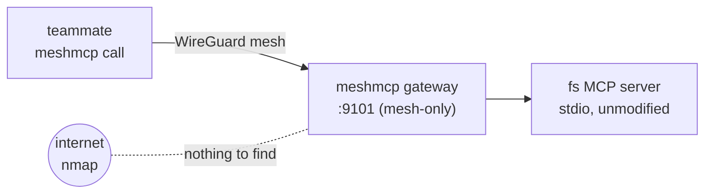

To use it from Claude Code, add a stdio bridge:

```jsonc
{ "mcpServers": { "home": {
  "command": "meshmcp",
  "args": ["connect", "--resumable", "100.81.5.9:9101"],
  "env": { "NB_SETUP_KEY": "<key>" } } } }
```

---

## 2. Stop prompt injection at the network layer

**Goal:** an agent that reads untrusted web content must not be able to perform a
privileged write, even if the content jailbreaks it.

```yaml
policy:
  default_allow: false
  rules:
    - peers: ["*"]              # fetch brings untrusted data in
      tools: ["fetch", "http_*"]
      allow: true
      taint_source: true
    - peers: ["*"]              # writes are blocked once the session is tainted
      tools: ["write_file", "run_command"]
      allow: true
      taint_guard: true
```

The decision is made from connection state the model can't see or influence, so
there is nothing to jailbreak.

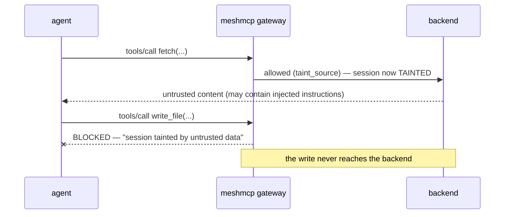

---

## 3. Never let PII leave the mesh

**Goal:** data read from an internal tool may not flow to an external egress tool.

```yaml
policy:
  default_allow: false
  rules:
    - peers: ["*"]                      # reading customer data tags the session
      tools: ["read_customer"]
      allow: true
      emit_labels: ["pii"]
    - peers: ["*"]                      # egress refuses once pii is present
      tools: ["post_external", "email_*"]
      allow: true
      block_labels: ["pii"]
```


No LLM guardrail or ordinary firewall can express a *flow* constraint like this.

---

## 4. Give an agent a credential it never holds

**Goal:** an agent calls a paid API without ever seeing the API key.

```yaml
# secrets.yaml (excerpt) — store values out of band, never in the config
backends:
  - name: payments
    port: 9120
    stdio: ["./mcpserver"]
    policy: { default_allow: false, rules: [ { peers: ["*"], tools: ["charge"], allow: true } ] }
    secrets:
      file: ./secrets.json          # {"stripe_key":"sk_live_..."}  (chmod 600)
      grants:
        - peers: ["pubkey:<billing-agent-key>"]
          secrets: ["stripe_key"]
          tools: ["charge"]
          block_labels: ["tainted"]  # no credential for a tainted session
```

The agent writes `{{secret:stripe_key}}` in the tool arguments; the gateway
resolves it by identity.

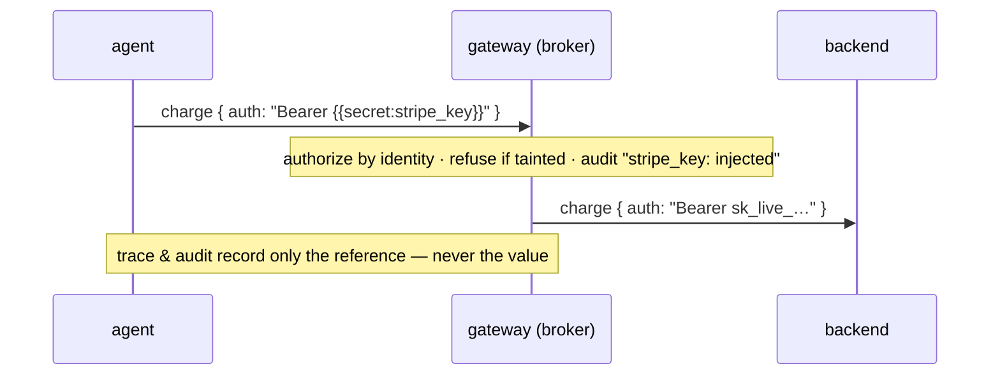

Validate without revealing anything: `meshmcp secrets check --config secrets.yaml`.

---

## 5. Prove to an auditor what every agent did

**Goal:** a tamper-evident, non-repudiable record of every tool call.

```yaml
backends:
  - name: guarded
    port: 9104
    stdio: ["./mcpserver"]
    audit_log: ./audit.jsonl
    audit_checkpoints: ./cps.jsonl       # Ed25519-signed Merkle checkpoints
    audit_signing_key: ./signing-key.json
    policy: { default_allow: false, rules: [ { peers: ["*"], tools: ["read_*"], allow: true } ] }
```

```bash
meshmcp audit keygen --out signing-key.json     # once; publish the public key
# ... run traffic ...
meshmcp audit verify audit.jsonl --checkpoints cps.jsonl --pubkey <key>
# OK  1240 records, 10 signed checkpoint(s), 1240 records committed
```

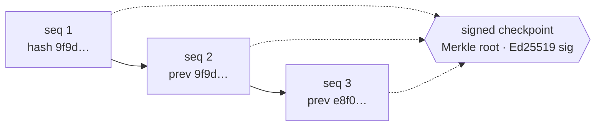

Edit any record — even re-linking the whole chain — and the recomputed Merkle
root no longer matches the **signed** root. It can't be forged without the key.

---

## 6. Generate a least-privilege policy from real traffic

**Goal:** don't hand-write a deny-by-default allowlist — learn one, then prove
it's safe before enforcing.

```bash
meshmcp insight profile   audit.jsonl                       # what agents actually do
meshmcp insight recommend audit.jsonl > policy.yaml          # least-privilege policy
meshmcp insight simulate  audit.jsonl --policy policy.yaml   # CI gate: exit ≠ 0 on regressions
meshmcp insight detect    today.jsonl --baseline last-week.jsonl   # drift → open a co-sign
```

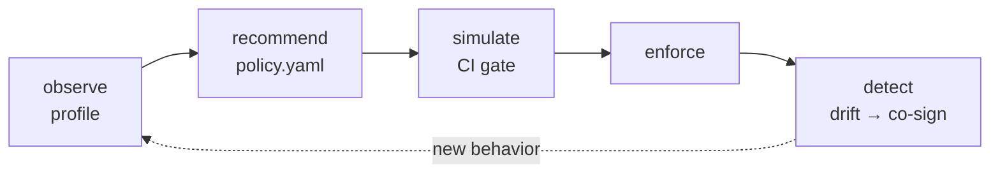

The recommended policy is guaranteed not to deny the traffic it was learned from
(a tested invariant); `simulate` catches any regression a *change* would cause.

---

## 7. Require a human co-sign for money movement

**Goal:** a privileged call is held until a human identity on the mesh approves it.

```yaml
policy:
  rules:
    - peers: ["*"]
      tools: ["transfer_funds"]
      allow: true
      require_cosign: true
# backend also sets: cosign_store: ./cosign
```

```bash
# the agent's call is held (denied with "requires a human co-sign") until:
meshmcp approve --store ./cosign <agent-fqdn> transfer_funds
# co-signed: <agent-fqdn> may call "transfer_funds" (approver: alice)
```

Approvals are identity-attributed, optionally expiring (`cosign_ttl_seconds`),
and revocable (`--revoke`). Silence is not permission.

---

## 8. Survive a gateway crash mid-session

**Goal:** a logical MCP session survives a gateway failover, without the client noticing.

```yaml
backends:
  - name: kg
    port: 9101
    stdio: ["./mcpserver"]
    resumable: true
    session_store: ./sessions      # shared between gateway replicas
```

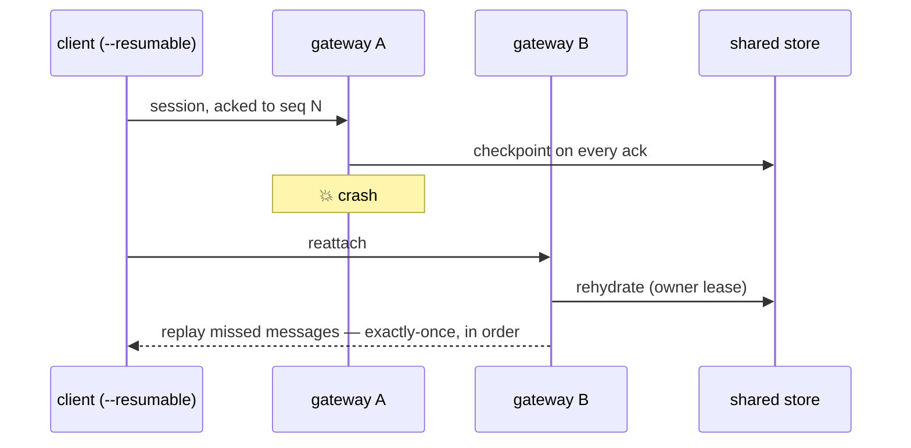

Checkpoints are ack-consistent and guarded by a cross-process ownership lease, so
failover is race-free.

---

## 9. Aggregate many servers into one endpoint

**Goal:** present N backends as one namespaced MCP endpoint with load-balancing and failover.

```yaml
# router.yaml
mesh: { device_name: router }
registry: ./registry            # discover backends dynamically
upstreams:
  fs:    ["100.81.5.9:9101"]
  tools: ["100.81.5.9:9102", "100.81.6.2:9102"]   # replica set
```

```bash
meshmcp router --config router.yaml
meshmcp ls   100.81.7.1:9100          # union: fs.read_file, tools.add, …
meshmcp call 100.81.7.1:9100 tools.add --arg a=2 --arg b=40
```

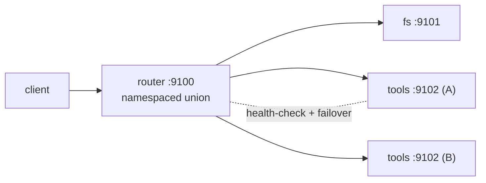

Round-robins replicas, fails over on transport error, re-dials down replicas in
the background, and relays full bidirectional MCP (sampling/elicitation).

---

## 10. Bridge two organizations

**Goal:** let another org's agents call *specific* tools of yours — no public endpoint on either side.

```yaml
# federate.yaml
port: 9300
upstream: 100.64.0.10:9101          # your local MCP server
audit: ./federation-audit.jsonl
mappings:
  - { match: "pubkey:<acme-gw-key>", org: acme, principal: "partner:acme" }
grants:
  - { org: acme, tools: ["read_*", "search"] }   # only these cross
```

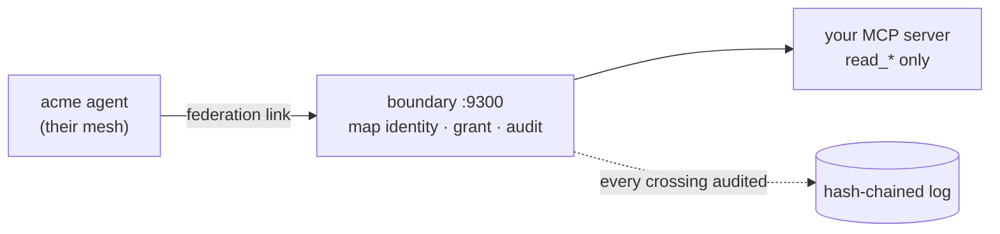

An unrecognized caller maps to no org and sees nothing; each org may call only
its granted tools; every crossing is identity-stamped and recorded.

---

## 11. Share a screenshot to a phone

**Goal:** the mesh dropped some images into a drop inbox; take inventory in the
terminal, then look at the actual pixels on a phone — without opening a port.

```bash
air vision ./drop-inbox                       # inventory: name/size/age/type
air vision ./drop-inbox --json --limit 20     # same, machine-readable
# now serve the pixels, phone-first, over the mesh — gated to one identity:
air serve --gallery ./drop-inbox --allow pubkey:<phone-key>
```

`air vision` never renders pixels in the terminal — it lists what landed. To
*see* an image, `air serve --gallery` renders the drops inline on the Air web
page (path-safe, gated by the viewer `--allow` ACL), reachable only from the
mesh.

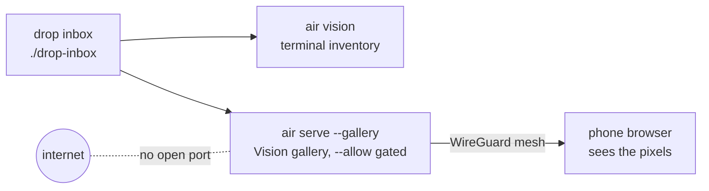

The gallery is a hardened browser surface (strict CSP, nosniff/frame-deny,
same-origin POST guard, Host-pin vs DNS rebinding) — and it renders only what the
`--allow` identity is cleared to view.

---

## 12. Notify on every deny — and escalate a co-sign hold

**Goal:** turn the audit ledger into a governed reaction layer — print a line on
every denial, and *act* on a co-sign hold — the Air way (`air bind`).

```yaml
# bindings.yaml — each binding matches audit fields by glob and fires one action
bindings:
  - name: notify-on-deny                 # always safe: print only
    on: { decision: deny }
    do: { print: "⛔ DENIED {peer} · {method} {tool} — {reason}" }

  - name: escalate-cosign                # ACTS — spawns a governed child
    on: { decision: cosign }
    do:
      run: ["air", "agent-steer", "100.64.0.5:9120",
            "--type", "nudge",
            "--text", "co-sign hold: {peer} wants {method} {tool}"]
```

```bash
air bind bindings.yaml --audit ./audit.jsonl                  # print reactions fire
air bind bindings.yaml --audit ./audit.jsonl --allow-exec     # run reactions also fire
air bind bindings.yaml --audit ./audit.jsonl --from-start     # replay, then follow
```

A `run` reaction is **deny-by-default**: `air bind` refuses to spawn it unless you
pass `--allow-exec`, because the child (`meshmcp …`) re-enters the firewall as its
own governed mesh action. Without the flag, the `notify-on-deny` print still
fires; `escalate-cosign` is held.

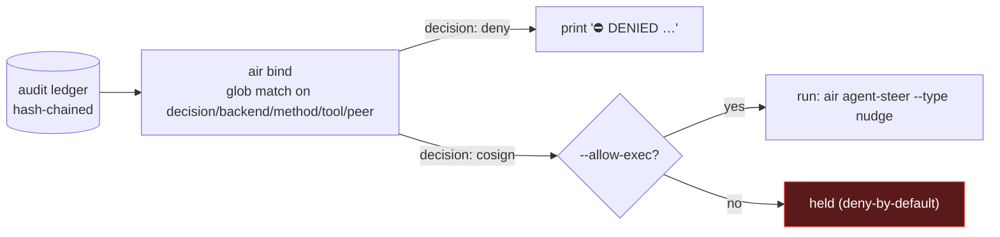

Templates expand `{peer}` `{tool}` `{method}` `{backend}` `{decision}` `{reason}`
`{time}`. The trigger is an already-governed, already-audited action; the reaction
is governed too. See [examples/air-bindings.yaml](../examples/air-bindings.yaml).

---

## Where to go next

- **[AGENT-FIREWALL.md](AGENT-FIREWALL.md)** — the policy engine, signed audit, dashboard, replay, control plane, federation.
- **[INSIGHT.md](INSIGHT.md)** — observe → recommend → simulate → detect.
- **[SECRETS.md](SECRETS.md)** — the credential broker and its threat model.
- **[spec/](spec/)** — the open audit-record and policy-DSL specs, with JSON Schemas.
- **[../examples/](../examples/)** — the full annotated config files these snippets are drawn from.
